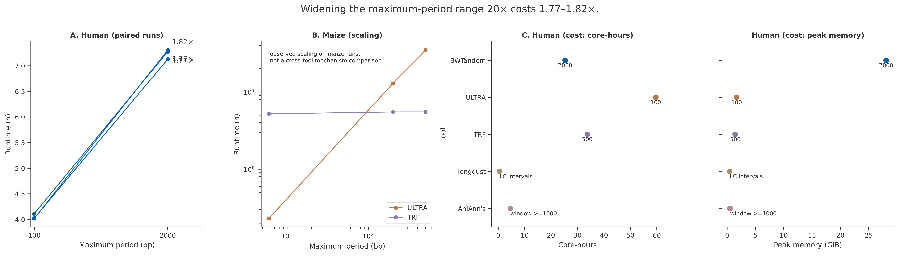
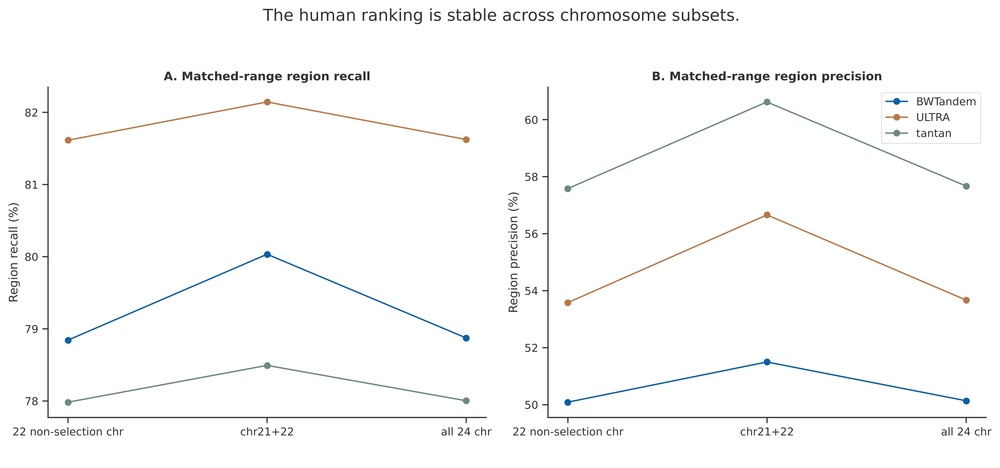
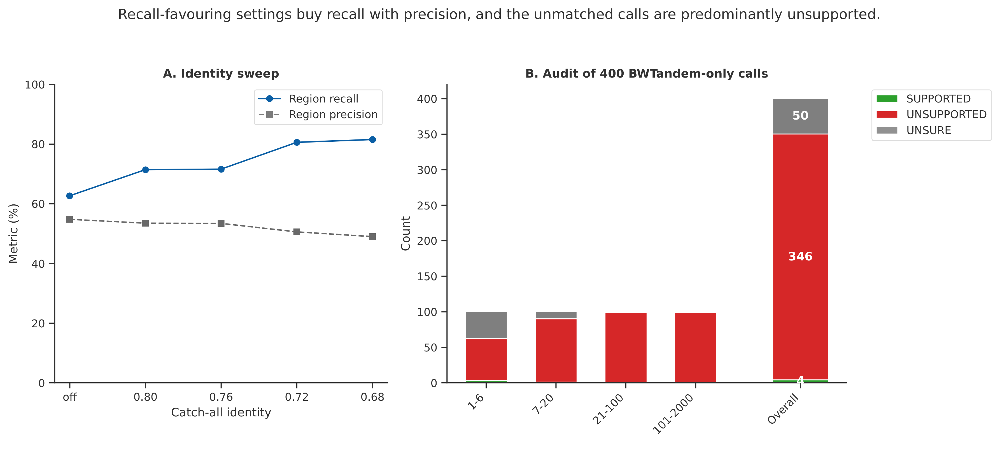
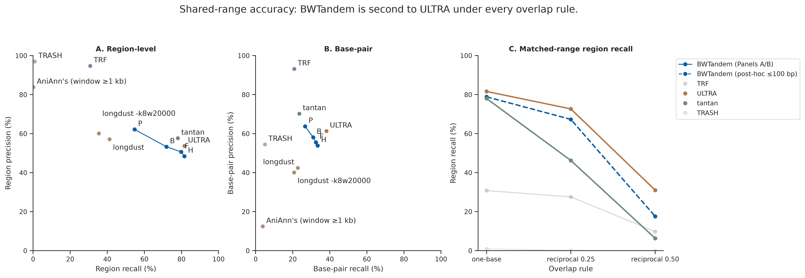
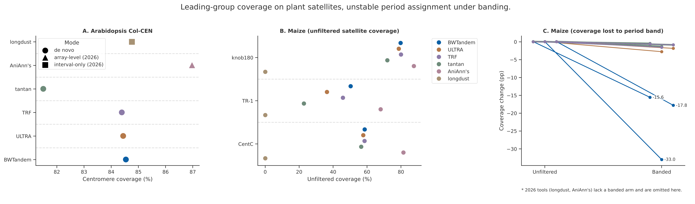
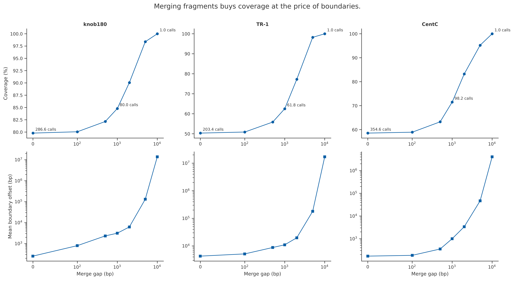
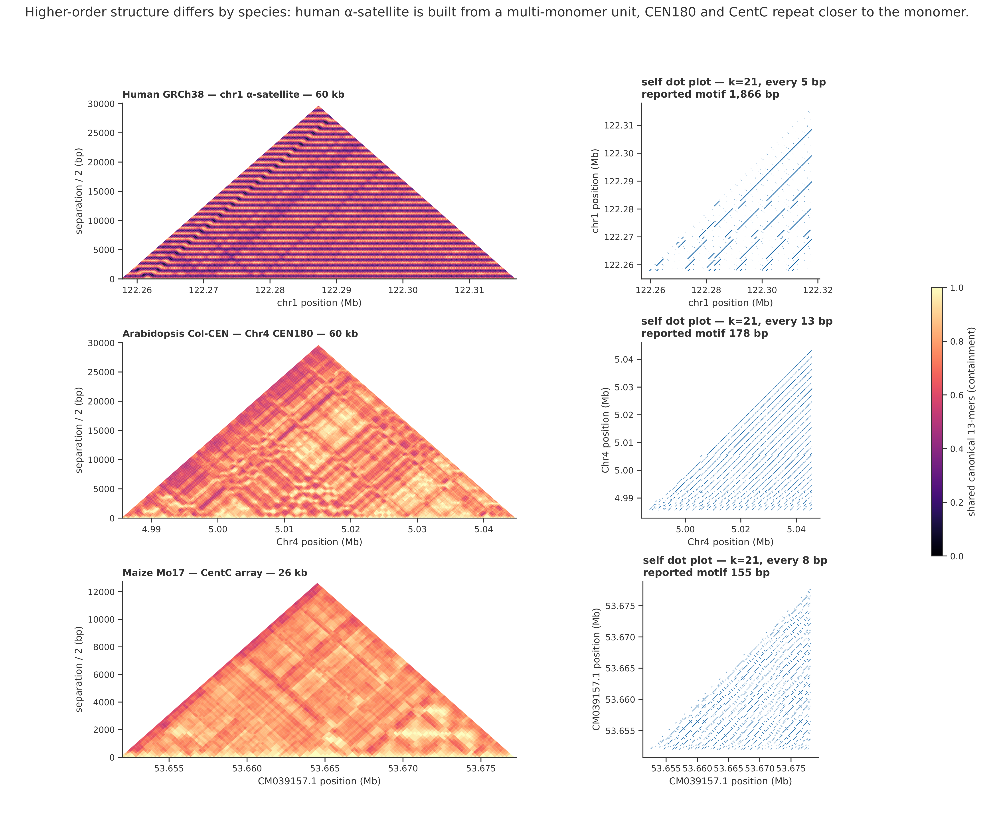

# Supplementary information for BWTandem

Filip Ramazan and Won C. Yim

## Reading guide

This supplement preserves all substantive sections of the long manuscript after
P4 corrections and C-8 abstract reconstruction (source commit `94df01e`). The
complete long source, including its front matter, is `manuscript_full.md`.
Section numbers and table identifiers are retained to preserve links to the
evidence manifest. Here “Supplementary Table 1a” means the former Table 1a;
pre-existing identifiers S1–S4 remain unchanged. Methods S1–S2 follow the full
methods, results, discussion and references. Main Figures 1 and 2 correspond to
Supplementary Figures 2 and 1, respectively. Supplementary Figures 3–5 and
S1–S2 are retained here, including the selected structural illustrations.

Table cell text and order are unchanged. All limitations, historical
retractions, definitions and provenance disclosures are retained. Legacy
captions embedded in figure images are replaced by the current external
captions; presentation copies leave `results/` untouched. Counts and source-
limited precision are not re-estimated. All references to numbered sections
below are internal to this supplement unless explicitly called “main text”.

<!-- preserved-body -->
## 1. Introduction
Tandem repeats (contiguous copies of a DNA sequence motif arranged head-to-tail) are ubiquitous in eukaryotic genomes. They range from microsatellites with 1–6 bp repeat units to megabase-scale satellite arrays that define centromeric and pericentromeric chromatin (Benson, 1999; Naish et al., 2021). Tandem repeats contribute to genome instability through replication slippage and unequal crossing over, are implicated in dozens of heritable human diseases through pathogenic repeat expansions, and serve as substrates for kinetochore assembly in centromeres (Willard, 1998; Mirkin, 2007). Their accurate detection matters for clinical diagnosis, forensic profiling, structural variant calling, and assembly quality control. They also remain among the most difficult genomic elements to characterize computationally.

The difficulty is that short tandem repeats (STRs, periods 1–6 bp) and satellite DNA (periods 100–2,000+ bp) present fundamentally different detection problems. STRs require identification of near-perfect microsatellite runs, whereas satellites tolerate substantial inter-copy divergence: Naish et al. (2021) report 94.3–97.3% identity between Arabidopsis CEN180 higher-order repeats, and monomer-to-consensus distances that leave a large minority of monomers well outside any narrow identity band. Satellite arrays also span megabases. Tandem Repeats Finder (TRF; Benson, 1999), the de facto standard for over two decades, uses k-tuple matching followed by wraparound dynamic programming and handles both classes reasonably well, but imposes a maximum detectable period of 2,000 bp and can become slow enough on satellite-rich sequence to bound what a scan can attempt; Section 3.2 gives the measurements. In practice the binding constraint is cost rather than that ceiling. Every period-parameterised detector must be told its search range in advance, and what a wide one costs is tool-specific and not predictable from the tool's description: on the maize genome ULTRA took 0.23 h at a maximum period of 6 bp, 12.86 h at 200 bp, and 34.73 h at 500 bp, while TRF at those respective ceilings took 5.22 h, 5.48 h and 5.51 h. Because a user cannot know in advance which case applies, the safe choice is a narrow range; the benchmark TRF runs were capped at 500 bp on human and 200 bp on Arabidopsis for that reason. A method whose runtime rises much less than the requested search range can make a whole-span pass practical, which is the design goal pursued here.

Subsequent tools have attacked different parts of the problem. Alignment-free and combinatorial methods such as mreps (Kolpakov et al., 2003) using Hamming distance and tantan (Frith, 2011) using low-complexity masking are fast but limited. mreps does not model indels, and tantan is designed for masking, though the per-call period and motif fields it emits are usable for scoring (Section 2.2.3). Probabilistic approaches such as ULTRA (Olson and Wheeler, 2024) apply HMM-based Viterbi decoding to label sequence as repetitive and report a period and consensus for each labelled region. At the other end, template-guided tools like NCRF (Harris et al., 2019) and satellite-specialized annotators like TRASH (Wlodzimierz et al., 2023) achieve high accuracy for known repeat families, but NCRF requires motifs to be specified a priori and TRASH requires substantial runtime on large genomes. TideHunter (Gao et al., 2019) was designed for noisy long reads rather than assembled genomes. A more recent line of satellite-specific tools postdates or sits outside our comparison set and is not benchmarked here: SRF (Zhang et al., 2023) reconstructs satellite units from k-mer counts without prior knowledge of repeat structure, while StringDecomposer (Dvorkina et al., 2020), NTRprism (Altemose et al., 2022), HiCAT (Gao et al., 2023), SatXplor (Volarić et al., 2024) and RepeatOBserver (Elphinstone et al., 2025) decompose or visualise higher-order satellite structure given a monomer. Their omission bounds what our comparison can say about the current satellite-annotation landscape. Two tools published in 2026 sit closest to this paper's territory and, unlike the list above, are benchmarked here (Section 2.2.4). longdust (Li and Li, 2026) finds low-complexity intervals with a probabilistic string-complexity model at very low cost, and its authors state its boundary plainly: "longdust is unable to report the repeat units in case of tandem repeats." AniAnn's (Sweeten et al., 2026) annotates satellite array boundaries and inferred monomer lengths from average nucleotide identity matrices; classifying arrays into named families "must be done through the use of a satellite k-mer database", and its window design (≥1,000 bp) cannot detect arrays substantially smaller than the window, per its own text. Measured here, the two profiles sit beside BWTandem's rather than against it: longdust recovers fewer catalog regions than BWTandem on GRCh38 (41.16% versus 80.53%, both over the full 1--2,000 bp range of Supplementary Table 1a rather than the matched 100 bp range of the abstract) and no curated maize satellite class at all, while AniAnn's posts the highest array-level satellite coverage of any tool we scored (86.97% on Col-CEN, 81.42% on CentC) with boundary offsets in the tens of kilobases and no per-copy structure. What neither longdust nor AniAnn's emits — and what BWTandem's output is organised around — is the per-array structured record: motif sequence, primitive period, copy count and purity, at call boundaries measured in base pairs.

The completion of telomere-to-telomere (T2T) assemblies for human (Nurk et al., 2022), Arabidopsis thaliana (Naish et al., 2021), and Zea mays (Chen et al., 2023) has resolved centromeric and satellite-rich regions for the first time. Combined with the GIAB consortium's adotto tandem repeat benchmark for human (English et al., 2024), these resources make it possible to evaluate detection tools across the full range of repeat classes on complete genome sequences. The human benchmark below uses GRCh38 rather than a T2T assembly, since the adotto catalog is defined on GRCh38, the human centromeric satellite the T2T assemblies resolved is therefore outside this comparison, and the T2T evidence here comes from the Arabidopsis and maize genomes.

Compressed indexes are not new to repeat analysis. Suffix arrays and suffix trees underpin the classical exact-repeat literature (Stoye and Gusfield, 2002; Kurtz et al., 2001; Abouelhoda et al., 2004), and the Burrows-Wheeler transform has been applied to tandem repeat detection before: BWtrs (Pokrzywa and Polanski, 2010) locates exact tandem repeats through backward search, and Danek et al. (2012) extend that line to approximate repeats. Those methods target exact or near-exact repeats and report them per query motif; BWTandem adds a tiered pipeline in which index seeding feeds an alignment and boundary-refinement stage, so that diverged satellite arrays spanning megabases are reported as single intervals. To the authors' knowledge, a detector combining a broad period range with a directly measured sublinear range cost has not been available. On the release build, raising BWTandem's maximum period from 100 to 2,000 bp, a twentyfold widening, costs 1.77–1.82 times the runtime across three paired runs (mean 1.79; Section 3.1). The earlier 1.30–1.41 estimate was too favourable because its nominally narrow arm still performed and discarded the long-period Tier 3 search. TRF and ULTRA also take a maximum period, which forces the user to bound the arrays sought before finding them; for ULTRA the bound is expensive to set generously. TRF's cost is nearly flat in it on maize (Supplementary Tables 3A–3C, and the series above), but not on human: its 2,000 bp attempt there ran 6.58 days without completing (Section 2.2). Which regime a genome and tool fall into is not knowable before the run, so the bound has to be set blind. mreps takes the same kind of argument, though it was run unbounded on human. tantan defaults to a maximum period of 100 bp and was left there for the original benchmark, so its original rows report nothing above that; the widened re-runs of Sections 3.2 and 3.3 are the exception and are labelled as such. TRASH in de novo mode needs neither a period bound nor a motif but pays in runtime, 107.63 hours on human. The template-guided tools sidestep the question by requiring the motif itself.

Here we present BWTandem, which uses the FM-index to replace exhaustive position-by-position alignment with targeted queries that return the suffix-array interval of a sampled k-mer in time proportional to the k-mer length, and its occurrence positions in time proportional to their number. Sparsely sampled k-mers whose occurrence positions form periodic patterns identify candidate repeat regions directly, and alignment runs only on confirmed candidates, which is intended to avoid the cost alignment-based methods incur on dense satellite arrays; Section 4.3 sets out what these measurements do and do not establish about it. BWTandem implements a three-tier pipeline: direct character comparison for microsatellites, optionally supplemented by an FM-index enumeration pass over short motifs (the configuration used for every run reported here), then LCP array analysis with BWT k-mer seeding for medium-length repeats, and sparse BWT k-mer seeding with adaptive parameters for long satellite arrays.

Three properties are demonstrated here. First, the regenerated human run covers periods 1--2,000 bp in 12 h 39 m, against 29.78 hours for ULTRA restricted to 1--100 bp and 33.73 hours for TRF at a 500 bp maximum; none of the three is range-matched and their FASTA scopes differ. BWTandem and ULTRA used two threads and TRF one, giving 25.29, 59.56 and 33.73 core-hours. Second, one wide-range configuration avoids per-genome range tuning; on Arabidopsis the regenerated run recovers 99.72% of the conserved CEN180 monomer truth set. Third, the native period-100 operating curve, regenerated on build-matched runs, spans 54.69% region recall at 62.16% region precision to 81.60% at 48.44% across four run-time configurations (Supplementary Table 1d, Supplementary Figure 1). We benchmarked three genomes against seven tools — TRF, ULTRA, mreps, tantan, TRASH, NCRF and TideHunter — of which all but TideHunter produced reported results; TideHunter was excluded for runtime without a completed run. Two tools published in 2026, longdust and AniAnn's, were added afterwards under a preregistered protocol (Section 2.2.4), bringing the reporting comparison to eight.
## 2. Methods
## 2.1 BWTandem Algorithm Architecture
## 2.1.1 Indexing and Data Structures
Given a genomic sequence S of length n, BWTandem constructs a suffix array using divsufsort (Mori, 2008), with a stated worst-case complexity of O(n log n), and derives the Burrows-Wheeler Transform in a single linear pass. An FM-index (Ferragina and Manzini, 2000) is built on these structures. Backward search returns the suffix-array interval of any query of length k in O(k) time, independent of how many times the query occurs; recovering the occ occurrence positions within that interval costs a further O(occ). These are derived costs for an individual query at fixed occurrence-checkpoint spacing. The seeder also samples the sequence and sorts each retained occurrence list, costing O(occ log occ) in the worst case, before a linear pass over adjacent positional differences identifies candidate periods; they are not bounds on the complete detection pipeline. For medium-length repeat detection, the longest common prefix (LCP) array (Kasai et al., 2001) is computed in O(n) time on first use by Tier 2 and cached for the chromosome; it is not built when Tier 2 is disabled. Index construction requires O(n) space.

BWTandem processes each chromosome independently, constructing a single FM-index and then applying a three-tier detection pipeline in sequence. Coverage masks record earlier detections and, during k-mer seeding, candidate spans even before refinement accepts them: Tier 2's general scan and Tier 3 sample k-mers only at unmasked start positions and reject seed runs more than half covered, while Tier 2's long-unit phase scans without the Tier-1 mask and instead discards any call that overlaps a Tier-1 interval.
## 2.1.2 Tier 1: Short Tandem Repeat Detection (Periods 1–9 bp)
The first tier detects microsatellites with periods of one to nine base pairs through an initial direct character-comparison scan; the additional FM-index stage is described below. For each candidate period p ∈ {1, …, 9}, the native scanner evaluates the match indicator M[i] = 1 iff S[i] = S[i + p] and the matching base is unambiguous; the Python fallback materializes a boolean vector. Consecutive runs of ones identify candidate repeat regions, retained only if the array's length reaches both an absolute floor and the period times a period-dependent minimum copy count, which imposes stricter thresholds on shorter periods. Under the relaxed short-period gate used by three of the four configurations the copy-count minimum binds only at periods six and nine; under BWTandem-P's higher floor it never binds, and at every other period the length floor is the binding constraint (Supplementary Methods S1.1).

Candidates are extended by whole copies to the right and then left against the fixed seed motif, with a cumulative Hamming mismatch budget of max(1, ⌈0.20 · p · copies⌉); extension is attempted for motifs of three bases or less only when the perfect seed already spans at least two copies (five in the library default), then refined via banded dynamic programming alignment, which simultaneously reduces the motif to its primitive period and computes consensus statistics. Candidates with quality scores below a minimum threshold are discarded. Periods are processed longest-first; an accepted call claims its seed span, and a shorter-period candidate whose start or midpoint falls in claimed sequence is discarded, so a period-6 array is not also reported at period 2 or 3.

An optional FM-index enumeration mode, enabled for every run reported in this paper, runs as an additive second stage, querying the whole index and screening candidate runs against the scanner's claimed spans (Supplementary Methods S1.1). It queries every primitive motif rotation (rotations are not collapsed to a canonical form) of each enumerated period length, 1 to 6 bp in this configuration, to retrieve their genomic positions. Positions linked by positive multiples of the motif length (tolerating up to two skipped copies per step) are grouped into candidate arrays, and two separate gates suppress false positives: a density floor (observed occurrences per expected copy) and a Poisson log-likelihood-ratio test of the observed occurrence count against an independent-bases null, with base composition estimated from a regularly spaced subsample of the chromosome (thresholds in Supplementary Methods S1.1); motifs occurring more than 2×10⁷ times on the chromosome being processed are skipped, which bounds the occurrence array materialised for any one motif. The pass applies its own acceptance gate in place of the length, score and copy-count gate above (Supplementary Methods S1.1).
## 2.1.3 Tier 2: Medium-Length Imperfect Repeat Detection (Periods ≥ 10 bp)
The second tier targets minisatellites and medium-length repeats containing substitutions and indels through two complementary phases.

In the first phase, the LCP array is scanned to identify adjacent suffixes sharing long common prefixes. For each pair where the LCP value is at least the phase threshold (10 here; the 10–50 bp scan's pre-pass uses max(8, min-period/2), which resolves to 8), the positional difference d = |SA[i] − SA[i + 1]| is computed. If d falls within the target period range, it becomes a candidate period seed. Seeds are extended bidirectionally with up to 30% mismatch tolerance in the runs reported here, the library default is 20%, and every run in this paper raised it (Supplementary Methods S2), reduced by exact and approximate motif-period tests, with additional autocorrelation checks during refinement (Supplementary Methods S1.2), and refined through banded dynamic programming alignment.

The second phase applies BWT k-mer seeding to regions the previous phases left at least half uncovered, which is the primary mechanism through which the FM-index drives repeat detection. K-mers of 9 bp are sampled every 5 bp in this phase (the long-unit phase above uses 10 bp k-mers every 10 bp) and queried via backward search in O(k) time. Occurrence positions are retrieved, sorted, and tested for arithmetic progressions with common difference within the target period range (a tolerance of max(1 bp, 3% of the first gap in the run)). Progressions with sufficient copies define candidate regions, which are extended bidirectionally and refined as in the first phase. Both sub-scans run an LCP pre-pass followed by k-mer seeding, over different windows: the long-unit scan covers periods of 20 bp up to the requested maximum (2,000 bp here, so it overlaps Tier 3's window), with LCP threshold 10 and 10 bp k-mers at stride 10; the general scan covers 10–50 bp with LCP threshold 8 and 9 bp k-mers at stride 5. Periods of 10–19 bp are therefore reached only by the general scan and periods above 50 bp only by the long-unit scan.

For highly diverged sequences where exact k-mer recurrence fails, an autocorrelation-based mode computes the fraction of positions where S[i] = S[i + p] across sliding windows. Contiguous stretches exceeding a minimum identity threshold (default 78%) are flagged as periodic, recovering arrays too diverged for seed-based detection. This mode is opt-in (`TIER2_APPROX_SEED`) and was left disabled in every benchmark configuration tabulated here.
## 2.1.4 Tier 3: Long Satellite Repeat Detection (Periods ≥100 bp)
The third tier detects long satellite arrays and centromeric repeats using the same BWT k-mer seeding procedure as Tier 2, with sparser sampling and longer k-mers suited to large period scales. Its supported interval is 100 bp to 100 kbp, but the interval actually searched is bounded by the command-line period limits: at commit `0363d8b`, the lower bound is max(100, `min_period`) and the upper bound min(100,000, `max_period`). The maximum-period argument therefore bounds the Tier 3 search as well as the final report. The historical commit `07ad6fa` instead searched the fixed internal interval and filtered afterwards, which made its narrow range-cost arms perform and then discard the long-period search (Section 3.1).

The tier automatically adapts its parameters based on input sequence properties. K-mer size scales logarithmically with sequence length (k = ⌊10 + 6 · log₁₀(max(n / 10⁵, 1))⌋ under the balanced preset used here; the fast preset raises it by 1 and the sensitive preset lowers it by 2, integer truncation of a ±1.2 shift), sampling stride scales proportionally to n / 40,000, and the maximum allowed k-mer occurrence count is set to n / 30,000 to filter low-complexity k-mers. GC content modulates the mismatch tolerance. When prior tier coverage exceeds 50%, the stride is reduced to scan uncovered regions more densely. Sequences above 100 Mb first take additional fixed caps, and all adaptive parameters are then clamped to implementation-defined ranges (Supplementary Methods S1.3). The parameters are computed per chromosome, so the realized values vary with chromosome length and composition, not genome: the stride saturates at 300 on every chromosome above roughly 24 Mb (and on the smaller Arabidopsis chromosomes unless prior-tier coverage exceeds 90%), the mismatch tolerance spans roughly 15–16.5% with each chromosome's GC, but the k-mer size runs from 24 on the smallest Arabidopsis chromosome to the 28 bp ceiling on chromosomes above 100 Mb, and the occurrence cap is 500 above 100 Mb while formula-driven below it, roughly 730–1,090 on the Arabidopsis chromosomes and up to the 1,500 ceiling on mid-sized human chromosomes, so a 90 Mb chromosome receives three times the occurrence budget of a 250 Mb one. Supplementary Methods S1.3 tabulates the realized values; the coverage-dependent stride reduction has no effect on sequences above roughly 24 Mb, because the clamp binds before it does.

Boundary refinement uses two strategies depending on array scale. For large arrays (more than 10 kb or more than 100 copies), an anchor-based strategy scans backward up to 20–80 and forward up to 200–800 period-length increments (chromosome-length dependent; Supplementary Methods S1.3), terminating when the match fraction drops below a threshold of 70–80%. Its cost is linear in the bases examined within those scan limits. For smaller arrays, banded semi-global edit-distance alignment refines boundaries copy by copy. That refinement scales linearly with copy count at fixed period, with quadratic per-copy work and storage in the period in the current implementation (Supplementary Methods S1.3); it is not quadratic in total array length.
## 2.1.5 Post-Processing and Supplementary Detection Modes
Post-processing consolidates raw detections by sorting coordinates, merging adjacent calls of the same motif family, and resolving overlaps. Five constants govern this, and we state them because they act directly on the coverage and base pair metrics reported below. First, the merge gap is period-dependent: max(10, p) bp for periods below 20, 10p for periods of 20–99, and 100p for periods of 100 and above, so two calls of a 178 bp monomer separated by as much as 17.8 kb of unclaimed sequence can be merged into a single interval. Second, merging normally requires the same canonical motif (the lexicographically smallest rotation among all cyclic permutations of the forward and reverse complement), but for motifs of 50 bp and longer, motifs of equal length within 10% Hamming distance are treated as one family. Third, overlap resolution retains the higher-scoring call only when the overlap exceeds half the shorter interval, comparing each call against the previously retained one in coordinate order, pairwise along the sorted list rather than globally; smaller overlaps leave both calls in the output. Fourth and fifth, a merge across a gap must also pass a content gate: for periods of 100 bp and above with a gap longer than the period, the intervening sequence must be at least twice the motif length and show autocorrelation identity of at least 0.55 at the motif period, the condition the 17.8 kb monomer merge above is subject to; a gap longer than the period but shorter than twice it fails the gate and the calls stay separate, and otherwise a trial re-scan of the merged span must keep the mismatch fraction within max(twice the calls' mean, 0.15). The order of operations is merge, then overlap resolution, then the two supplementary passes below, each followed by a re-merge (the gap-fill runs up to twice and the catch-all last), so overlap resolution never sees the supplementary calls. Merging uses consensus motifs where available; after a successful merge, consensus and mismatch statistics are recomputed only for spans up to 50 kb. Longer merged calls retain the preceding call's statistics while their coordinates and copy count change. Requested period and array-length bounds are checked when tier calls are registered and again after all supplementary passes.

Two supplementary passes address gaps in the core pipeline. A satellite gap-fill pass examines uncovered blocks flanking detected satellite arrays (motif of at least 100 bp) and evaluates autocorrelation identity at candidate periods between 100 and 360 bp, further restricted to less than half the nomination-window length (Supplementary Methods S1.4). Only uncovered blocks of 300 bp to 100 kb intersecting the 50 kb neighborhood of such an anchor are considered. Up to three 5 kb windows nominate the best period; the implementation then evaluates that period across the whole block with sliding windows and emits only contiguous segments that meet the identity and valid-base gates, rather than emitting the entire uncovered block. The nomination search stops early at the first period exceeding 0.80 identity, and the complete block must contain at least 80% unambiguous A/C/G/T bases, and supporting windows must have at least 80% valid offset comparisons, with both bases unambiguous; the same comparison floor governs the catch-all periodicity pass. This recovers interior gaps within highly diverged centromeric arrays while preventing one periodic edge window or an ambiguous assembly gap from licensing an unsupported long interval.

An optional catch-all periodicity pass evaluates windowed autocorrelation at default periods 1–20 bp by computing whole-chromosome match counts and masking covered window starts, in O(n) time per period, using a window of twice the candidate period subject to a 12 bp floor. Stretches of at least 20 bp exceeding a minimum identity threshold (default 72%) and spanning a minimum copy count (length divided by period; default two, three in the human and maize runs) are reported as additional detections, with a passing run of window starts [a, b) reported as [a, min(b + window, n)); this endpoint differs from the full window-plus-period span used by the satellite gap-fill (Supplementary Methods S1.4); candidates already more than 30% covered by an existing call are dropped. Periods are evaluated longest-first and an accepted call excludes its span from shorter periods. Both supplementary passes use periodicity scans rather than FM-index queries and emit calls without DP refinement. Their scan windows are set independently of the requested period bounds; the final output is filtered to those bounds. Their initial mismatch rates use the mean passing-window support for satellite segments and the maximum passing-window support for catch-all calls, rather than whole-call alignment identity. This mode (the catch-all periodicity pass, the name used throughout) emphasizes STR recall and is disabled by default, so the human and maize headline numbers require it to be enabled explicitly (Supplementary Methods S2).
## 2.2 Benchmarking Methodology
BWTandem was benchmarked against seven tools: TRF 4.10.0rc2 (Benson, 1999), mreps 2.6.01 (Kolpakov et al., 2003), ULTRA 1.2.1 (Olson and Wheeler, 2024), tantan 51 (Frith, 2011), NCRF 1.01.02 (Harris et al., 2019), TRASH v1 (Wlodzimierz et al., 2023), and TideHunter 1.5.6 (Gao et al., 2019). Every competitor run of the original benchmark was executed inside one Singularity container; the two 2026 additions and the ULTRA 2,000 bp attempt ran outside it, from local installations, as Supplementary Table S1 records. Versions and command lines are listed there; the original command lines, including mreps and NCRF, are also preserved in the deposited GNU-time logs. Six of the seven produced results we report. TideHunter produced no completed run on any of the three genomes and is absent from every table; the runs were abandoned for runtime, but we did not record the elapsed time at which they were killed, so we can state the exclusion without quantifying it. mreps was excluded from the maize experiments for runtime and did not complete on human (Supplementary Table 1a). NCRF was excluded on human for memory: it required 80.96 GiB on the 132 Mb Arabidopsis assembly (Supplementary Table 2), and no completed human run exists. TRASH was evaluated in both de novo and template modes on Arabidopsis and on maize experiments 3A and 3B; its de novo run did not complete on experiment 3C, so Supplementary Table 3C carries the template row only. On human only the de novo mode was run, so the single human TRASH row is a de novo result. Motif-guided tools were provided exact consensus sequences. Two further tools published in 2026 — longdust 1.4 and AniAnn's 0.7.1 — were added later under a separate preregistered protocol (Section 2.2.4) and are reported in Supplementary Tables 1a, 2, 3B and 3C.

Period search ranges were not uniform across tools, and because this affects which metrics are comparable we state them explicitly. BWTandem was run at 1–2,000 bp on every genome. TRF has no minimum-period parameter and was run to a maximum of 500 bp on human, 200 bp on Arabidopsis, and the maximum matching each maize experiment. TRF's -l parameter, which sets the longest expected array in millions of base pairs, was left at its default of 2; the TRF documentation recommends 6 for GRCh38, and all three assemblies contain arrays that the default may truncate. TRF's coverage and cost figures here should be read with that in mind. ULTRA was run at its default maximum period of 100 bp on human and at 6, 500, and 200 bp for maize experiments 3A, 3B, and 3C; the maize and Arabidopsis-re-run invocations additionally set --read_all, -i 3 and -d 3, which the human run did not (Supplementary Table S1). tantan was initially run at its default maximum period of 100 bp on every genome, and was subsequently re-run over wider windows on all three: 500 bp on Arabidopsis, 200 bp and 500 bp on maize, and 2,000 bp on human. Supplementary Tables 2, 3B-b and 3C-b report the re-runs, Supplementary Table 1 reports the original run with the re-run alongside it, and every original figure is retained in the corresponding caption. The effect is not uniform across the three genomes and is set out where each table is discussed. mreps was run without period bounds on human. On Arabidopsis, ULTRA, mreps and tantan at their original settings could not represent a 178 bp monomer (ULTRA at a 100 bp maximum, mreps at 6 bp, tantan at a 100 bp window), so all three were re-run, at a 500 bp maximum, over 150–400 bp, and at a 500 bp window respectively, and Supplementary Table 2 reports the re-runs. TRF's cost proved nearly flat in its maximum period on maize (Supplementary Tables 3A–3C), but that flatness does not extrapolate to human at wider ranges: a post-hoc verification run at 2,000 bp on human was terminated without completing after 6.58 days, 4.68 times its 33.73-hour 500 bp wall clock and with partial output only, so the 500 bp cap was materially cheaper than the alternative and the above-100 stratum of Supplementary Table 1c remains unmatched. The same check was made for ULTRA. A run matching the published human invocation except for a 2,000 bp maximum period — ULTRA 1.2.1, the same GRCh38 sequence content under different accession headers, two threads (Supplementary Table S1) — used a separate local installation of the binary rather than the Singularity sandbox the published competitor runs were executed in; the two are different files that both self-report 1.2.1, so the pair is matched by invocation, input and self-reported version rather than by artefact or environment. We stopped it after 1 d 22 h, by which point it had emitted calls only for the first 124.79 Mb of chromosome 1, about 4% of the 3.25 Gb assembly file the competitors were run on, in 1.55 times the wall clock its 100 bp run took for the whole of it; that ratio therefore compares a completed run with an incomplete attempt; the last emitted coordinate does not establish how much input was processed, and the 29.78-hour figure it divides is one of the inherited GNU-time measurements described above. Its output file had not grown for five hours, with its most recent calls lying in the chromosome 1 centromeric satellite, and its cgroup peak was 17.14 GiB against 1.68 GiB by GNU time at 100 bp: a sampled cgroup maximum against a GNU-time maximum, on different hosts, in different environments, one of the two killed mid-run, so we report both figures and do not compare them quantitatively. We stopped the run because extrapolating the pre-stall output-coordinate rate of about 3 Mb per hour puts the whole file well beyond our 14-day partition limit, which bounds our allocation rather than the tool; that extrapolation rests on one chromosome and can err in either direction, since what remains holds both easier euchromatin and 23 further centromeres, and output growth had already stopped. The TRF and ULTRA elapsed-time ratios above are lower bounds on completion cost in the respective attempt environments, not measurements of completed wide-range runs. We therefore leave the ULTRA cap, like TRF's, as published, and the 101–2,000 bp stratum has no ULTRA arm. Search ranges therefore differ by up to twentyfold on human and by more than three hundredfold across the maize experiments. Region recall shifts by at most 1.66 percentage points and region precision by at most 1.73 (Supplementary Tables 1a, 1b), but base pair metrics computed over the full range are not directly comparable between tools, because the output-period bands differ. Exact above-100 shares of merged called bases cannot be recomputed from the deposited rounded summaries without reprocessing the BEDs, so earlier percentage estimates are not used for the regenerated comparison; ULTRA and the tabulated tantan run report nothing above period 100. Section 3.1 therefore reports a matched-range comparison restricted to periods ≤100 bp, the widest range every tool could enter, alongside the full-range figures and a separate stratum for periods 101–2,000 bp. The human tantan re-run at a 2,000 bp window does enter that stratum and is reported in it (Supplementary Table 1c), which removes the one tool whose absence there was a parameter choice of ours rather than a property of the tool.
## 2.2.1 Computational Environment and Execution
All benchmarking was performed on the University of Nevada, Reno Pronghorn HPC cluster using Intel Xeon E5-2683 v4 processors at 2.10 GHz, with each genome processed as an independent SLURM job. Allocations differed by tool: the BWTandem whole-genome runs behind Supplementary Tables 1a–1c, 2 and 3 used two worker processes, and the native period-100 operating points in Supplementary Table 1d used four (`--threads` selects a ProcessPoolExecutor), TRF, mreps and tantan used one active thread, while ULTRA and TRASH requested two workers and AniAnn's two jobs; longdust had no parallelism flag. These are execution settings, not a uniform CPU-allocation count: the widened tantan jobs reserved two CPUs but used one active thread. Cost figures fall into two provenance classes and the distinction should be read into every runtime and memory cell below. The regenerated BWTandem table rows are traceable in the provenance manifest to job identifiers, elapsed times and cgroup peaks. The historical seeding-ablation arms instead use per-arm GNU-time measurements. Competitor thread counts are inferred from the surviving command lines rather than from job records: ULTRA was invoked with -t 2, and TRF, tantan and mreps are single-threaded by construction. The core-hour normalisations quoted here follow from those inferences. The original competitor figures are inherited from an earlier benchmarking round whose SLURM accounting records no longer exist; subsequent re-runs and the 2026 additions have separate records. What does survive is that round's GNU-time output, one log per tool and assembly, each recording the full command line, the elapsed wall clock and the maximum resident set size; the human logs give ULTRA 29:46:49 and 1,758,540 kB and TRF 33:43:46 and 1,518,668 kB, which are the 29.78 h at 1.68 GiB and 33.73 h at 1.45 GiB reported below. Those cells are therefore checkable against a preserved artefact, although they cannot be re-derived without re-running, and they remain GNU-time measurements rather than the cgroup peaks the BWTandem rows carry. The ULTRA and mreps Arabidopsis re-runs have job records and carry accounting values like the BWTandem rows. Later tantan re-runs and the 2026 additions are identified separately in the manifest. We report them because they are the best record available and because the accuracy figures they accompany do reproduce, with the accounting method and input scope stated for each class; documentation does not make the two memory measures interchangeable.

The regenerated whole-genome BWTandem results were produced from clean commit `0363d8b` with Python 3.11.14 and numpy 2.3.1. Human and maize used two worker processes, periods 1--2,000, the relaxed short-period gate, and the catch-all pass at identity 0.72 with at least three copies; Col-CEN used two worker processes and periods 1--2,000 with the catch-all pass disabled. SLURM accounting measured 12 h 38 m 42 s and 28.08 GiB for human, 15 h 51 m 03 s and 28.45 GiB for maize, and 40 m 11 s and 2.16 GiB for Col-CEN. The regenerated whole-genome BWTandem rows use SLURM elapsed time and sacct MaxRSS. Original competitor rows retain GNU-time measurements; later re-runs use the per-run sources described above, including accounting values for the ULTRA and mreps Arabidopsis re-runs. The historical seeding ablation and paired BWTandem range-cost arms use their separately recorded per-arm measurements. Every memory figure in this paper, from either source, is the reported kibibyte count divided by 1024², and is written GiB accordingly. The raw accounting is deposited: `results/sacct_provenance.txt` holds verbatim `sacct` output for a subset of the SLURM jobs named in the manifest, including all three regenerated whole-genome runs; original accounting rows are not deposited for the nine native-panel/sweep tasks `6141841_0`, `6143150_1–3` and `6143151_0–4`, so their manifest elapsed-time and cgroup-memory transcriptions cannot be independently checked against deposited raw accounting, and `results/competitor_logs/` holds the inherited `/usr/bin/time -v` competitor logs; later re-run records are identified separately in the manifest, which until now existed only on the benchmarking cluster. The two sources are not interchangeable: sacct reports a sampled cgroup maximum, while GNU time reports the maximum over child processes rather than their sum, which understates a tool that distributes work across workers. The human regeneration removed 202 pathological catch-all intervals spanning 77.35 Mb that the old implementation had extended through ambiguous sequence by treating `N == N` as periodic evidence. Call count therefore remained similar (4,009,261 to 4,014,108) while base-pair precision rose from 31.51% to 42.74%; this is a correctness change dominated by a small number of giant intervals, not a summation artifact. The revised gap-fill additionally emits only locally supported contiguous segments. The regenerated Col-CEN row must likewise be read as a revised-method result: its CEN180-band count rose from 1,380 to 1,533 mainly because legacy satellite blocks were split, with smaller Tier-2 and Tier-3 contributions, while 150--400-bp monomer recall fell from 95.21% to 94.68% and unfiltered recall remained 99.72%. Tier-3-only ablations attribute 53--86% of the overall Tier 3 increase of 65 calls, and essentially all of the 15-call CEN180-band increase, to the revised tolerance formula; the remainder is not attributable to that change. Native period-100 operating-point regenerations at the same commit ran as SLURM jobs 6141841 and 6143150, and the full-range identity sweep as job 6143151 (originally submitted as jobs 6129408 and 6129410, which failed at startup before producing any output and were resubmitted with identical detection settings); all nine runs have deposited wrapper provenance recording clean execution commits and four threads, but those records do not replace the missing raw scheduler accounting, and Supplementary Tables 1b and 1d, Supplementary Figure 1, and Supplementary Table S3 report their scored values.
## 2.2.2 Genome Assemblies
Performance was assessed across three genome assemblies representing distinct scales and repeat landscapes. The human GRCh38 reference genome (3.09 Gb) served as the primary benchmark target. The two sides of that comparison used different files, and we state the difference because it bears on the cost figures. The competitors were run on the GenBank FASTA for accession GCA_000001405.15, which carries unplaced scaffolds and alt loci in addition to the chromosomes; BWTandem was run on the 24 primary chromosome sequences of the UCSC hg38 release of the same assembly (chr1–22, X, Y; 3.088 Gb of sequence, 2.938 Gb of it unambiguous). Scoring restricts both sides to those 24 chromosomes (competitor outputs were first converted to UCSC chromosome names via the accession map in the deposited conversion script, and everything unmapped is dropped), so no accuracy figure is affected; tantan, for example, makes 149,706 of its calls outside them, and all are discarded before scoring. The competitors' runtime and memory do, however, cover roughly 4% more sequence than BWTandem's: 3.209 Gb against 3.088 Gb, or 3.049 Gb against 2.938 Gb counting unambiguous bases only. The telomere to telomere Arabidopsis thaliana Col-CEN v1.2 assembly (132 Mb, Naish et al., 2021) provided a compact genome with well characterized centromeric satellite arrays; the assembly is distributed at https://github.com/schatzlab/Col-CEN, and the reads it was built from are in ArrayExpress under E-MTAB-10272 (Oxford Nanopore) and the European Nucleotide Archive under PRJEB46164 (PacBio HiFi). The Zea mays Mo17 T2T assembly (2.18 Gb, Chen et al., 2023, GenBank accession GCA_022117705.1) served as a large, repeat rich crop genome with multiple annotated satellite families.
## 2.2.3 Evaluation Metrics
Measured quantities and derived comparisons are reported to two decimal places using decimal half-up rounding, calculated from deposited values before rounding; counts remain integers and parameters, thresholds and version strings retain their native notation. Where the surviving source provides only coarser precision or an unlogged engineering observation, that precision is retained and the limitation is stated. For the human genome (Experiment 1), accuracy was evaluated against release v1.2.1 of the GIAB adotto tandem repeat region catalog (English et al., 2024; https://zenodo.org/records/13987414), restricted to chr1–22, X and Y. Region-level recall and precision were defined as the fraction of benchmark or tool-predicted regions overlapping at least one counterpart by at least one base pair (`bedtools intersect -u`); no reciprocal-overlap fraction was required. That criterion is generous to tools reporting few long intervals and should be read alongside the call counts, which differ by three orders of magnitude across the tools compared, and alongside the period-dependent merge described in Section 2.1.5, under which one BWTandem interval can satisfy several benchmark regions. A reciprocal-overlap sensitivity analysis was recomputed on the regenerated BED at reciprocal fractions of 0.25 and 0.50 (`bedtools intersect -f <x> -r`, region metrics only; deposited under `results/regen/`). The one-base rule remains the rule used in Supplementary Tables 1a--1e. Under the stricter rules every tool's region figures fall steeply, because the catalog's merged, slop-padded regions make high reciprocal overlap unattainable by construction, so the absolute values are a stress test of boundary conventions rather than a ranking; what survives every rule is the ordering among the high-recall callers on the matched range: ULTRA first and BWTandem second in region recall under all three rules (81.62 and 78.87 at one base, 72.67 and 67.31 at 0.25, 31.05 and 17.61 at 0.50), while tantan's near-tie with BWTandem at the one-base rule does not survive reciprocal overlap (78.00, then 46.23, then 6.37), reflecting its long merged masking intervals. Base-pair metrics do not depend on the region-overlap fraction. Region-level figures in Supplementary Tables 1a–1e should therefore be read as specific to the one-base-pair rule, not as a tool ordering that survives a stricter one. Base pair recall and precision were computed on merged intervals and are not subject to that effect. Concretely, tool intervals are merged with bedtools; base pair recall is the summed length of intersections between benchmark regions and merged tool intervals divided by the total length of the benchmark regions as distributed (the benchmark side is not merged), and base pair precision the same intersection divided by total merged tool bases. The benchmark is a region catalog of merged intervals around repeat loci, not a base-resolution repeat annotation, so base pair metrics against it inherit its interval conventions. Every period band in this paper (the matched-range and stratum panels, the Supplementary Table 2 CEN180 band, and the maize bands of Supplementary Tables 3A-b, 3B-b and 3C-b) reads the tool-reported period column, falling back to the length of the motif column where a tool reports none, as BWTandem's own BED does (its fifth column is a copy count). Called bases were additionally classified by distance to the nearest benchmark region (inside, outside but within 500 bp, and more than 500 bp away) on merged tool intervals against the catalog; that decomposition was run for BWTandem, ULTRA and tantan only. The adotto catalog is a polymorphic-tandem-repeat benchmark rather than a repeat annotation: its regions are merged with 25 bp of slop, and regions carrying no observed non-SNP variant were removed, which discards a majority of catalogued loci. Precision and recall in Supplementary Tables 1a–1e are therefore measured against a catalog of variable tandem repeats, not against all tandem repeats present in GRCh38, and a call absent from it may be a monomorphic repeat rather than a false positive. Because that catalog is incomplete for our purposes, we computed a catalog-or-cross-tool support rate in which predictions not overlapping any benchmark region were tested for corroboration by ULTRA and tantan, a prediction counting as corroborated if it overlaps any corroborator call by at least one base pair, and corroborated predictions were reclassified as true positives. This rate is cross-caller overlap under a permissive one-base rule, not validated precision: the callers are not independent, may share failure modes, and can mutually corroborate the same error. mreps is not scored on this genome and acts as corroborator in neither rule. A tool cannot corroborate its own calls, so the ULTRA and tantan rows have one corroborator each while the remaining rows have two; catalog-or-cross-tool support rate is consequently not directly comparable across rows of Supplementary Tables 1a and 1e, and we also report a symmetric leave-one-out variant in which every other tool acts as a corroborator. Neither corroborator searched above period 100, so neither can corroborate a call above it; we verified that this biases the figure by +0.15 percentage points (79.45% full range versus 79.60% after excluding the above-100 stratum), since such calls are 2.56% of the total, and the bias runs against BWTandem rather than for it. The number of regions detected by one tool and none of the other four (BWTandem, ULTRA, tantan, TRF, TRASH) was recorded on the unfiltered outputs; mreps is excluded (Supplementary Table 1a). To test directly whether the calls unsupported by both the catalog and every other tool are repeats or over-calls, we audited a stratified blinded sample of the BWTandem-only calls, the 809,886 regenerated full-range calls overlapping neither the catalog nor any of TRF, ULTRA, tantan or TRASH: 100 calls per reported-period stratum (1--6, 7--20, 21--100 and 101--2,000 bp), drawn at a fixed seed and rendered as source-blinded self dot-plots and unit-shift identity curves with the call boundary and a random-composition reference marked. A call was judged SUPPORTED only when the proposed period produced at least three copies whose within-call periodicity was visibly stronger than both flanks; the allowed verdicts were SUPPORTED, UNSUPPORTED and UNSURE. The protocol specified two readers with blind adjudication; one author completed the reading before submission, so the result is reported as a single-reader audit and carries that limitation. The sampler, the blinded sheet, the verdicts and the aggregation are deposited; the original images, renderer/settings, source population BED and separate reader attestation are not, limiting exact visual and provenance reconstruction (Data and Code Availability).

In addition to the permissive region rule and the reciprocal-overlap sensitivity analysis above, a strict one-to-one, boundary-aware evaluation was computed on the Supplementary Table 1a human baselines (Supplementary Table S4; `scripts/scoring/score_one_to_one.py`, SLURM job 6146229, deposited under `results/one_to_one/`; an earlier deposited measurement is superseded there for the reasons its README records). Truth records and predictions were matched by maximum-cardinality bipartite assignment (Hopcroft–Karp), each record participating in at most one match and eligibility requiring the intersection to cover at least 50% of both records. One-to-one sensitivity is matched pairs over truth records and one-to-one precision is matched pairs over predictions — record-count fractions, distinct from the ≥1 bp region-overlap fractions of Supplementary Tables 1a–1e. Because the catalog's truth records do not overlap one another, the 50% reciprocal requirement already makes per-truth matching essentially injective, so one-to-one assignment leaves sensitivity identical to a many-to-one `bedtools -f 0.50 -r` baseline (`results/regen/recip_0.50.txt`, full-range block) and changes only precision, by charging every additional call a tool makes on the same truth record; the one-to-one panel is therefore a precision statement, not an independent confirmation of the sensitivity ordering. Predictions on sequences absent from the chr1–22XY truth were dropped before computing precision (130,506 ULTRA, 149,706 tantan, 48,568 TRF and 198 TRASH calls on unplaced scaffolds; BWTandem ran on the primary assembly), so denominators are comparable across tools run on different FASTA scopes; each tool otherwise entered at the range of its Supplementary Table 1a run — not its maximal supported range — and the tantan 2,000 bp re-run of Supplementary Table 1c is not part of this panel. Two truth sets were scored. The region truth is the catalog's region set as distributed; its regions are merged and slop-padded roughly 25 bp beyond the underlying annotation, which both makes 50% reciprocal overlap unattainable for much of the catalog and imposes a ~25 bp floor on region-arm boundary error. The annotation truth takes each region's highest-score annotation at the annotation's own coordinates, with the motif reduced to its primitive period and the copy count rescaled by the reduction factor — a disclosed simplification for compound regions whose direction should be stated: a tool that correctly reports one of a region's other motifs scores as a period disagreement. Matched pairs were scored for boundary error, period-length agreement (exact, integer-multiple, and within 20% smaller-period-relative, reported separately rather than pooled; this compares period lengths, not motif sequences), and copy-number relative error — the latter reported for BWTandem only, because the converted competitor BEDs carry the period, not a copy count, in their fifth column. Among equal-cardinality matchings the pairing is arbitrary, an indeterminacy the matched-pair statistics inherit; the maximum cardinality itself, and hence sensitivity and precision, is unique. The permissive matcher used for the synthetic regression suite is retained unchanged as a named regression metric and produces no figure in this paper.

For Arabidopsis thaliana (Experiment 2), performance was measured as mean centromere coverage across five centromeric regions (Naish et al., 2021), computed with no period filter. CEN180 monomer recall was computed against reference monomer coordinates obtained by aligning a 177 bp consensus to the Col-CEN v1.2 assembly with blastn. We use the family's common name CEN180 in column headers; the Col-CEN literature names the family CEN178 after its 178 bp modal monomer length, and the consensus we aligned is 177 bp, three numbers, one family. The blastn version and command line were not retained, so we deposit the inputs and outputs rather than the invocation: the consensus sequence, the 68,840 raw hits (`results/ground_truth/colcen_cen180_raw_blast_hits.bed`) and the 66,683 monomers that survive filtering (`colcen_cen180.bed`), whose coordinates are a strict subset of the raw set, so the 2,157 dropped hits are enumerable. The identity values that drove the filter appear only in the filtered file, so the threshold is attested rather than recomputable from the raw hits. Of the surviving monomers 94.59% fall within 175–179 bp, the full range being 120–206 bp, at 80–100% identity. Monomer recall is therefore measured over this conserved subset; monomers diverged below 80% identity from the consensus are outside the truth set. Recall depends strongly on where in that subset a monomer sits, which bounds how far the headline figure can be read. Partitioning the 66,683 monomers by their identity to the consensus and rescoring the regenerated output, BWTandem recovers 99.89% of the 37,663 monomers at 90 to 95% identity and 99.91% of the 25,719 at 95 to 99%, but 99.08% of the 2,389 at 85 to 90% and 87.32% of the 812 at 80 to 85%; the 100 monomers above 99% identity, a fifth stratum too small to carry weight, sit at 99.00%. Every tool falls the same way over the same partition: ULTRA from 99.93% to 89.04%, TRF from 97.36% to 83.74%, tantan from 99.56% to 77.34%. The competitor rows are their published outputs; earlier versions of this paragraph gave BWTandem's historical Col-CEN output (86.95% in the lowest stratum) rather than the regenerated one Supplementary Table 2 reports. Since 95% of the truth set sits above 90% identity, the aggregate figures are set by the conserved majority, and the trend across the strata runs downward toward the 80% floor. Recall over all CEN180 monomers, including those the truth set excludes, would therefore be lower than the reported aggregate; the raw hit coordinates are deposited, but their identities were not retained, so they do not establish recall below the filtering threshold. Every row of Supplementary Table 2 is scored against that one coordinate set, so no comparison in this paper depends on the lost command; a reader regenerating the coordinates from scratch would, however, have to choose their own parameters and should expect a slightly different set. The three CEN180 columns of Supplementary Table 2 use different call sets, applied identically to every row: monomer recall accepts a call of any reported period; the CEN180 count admits only calls of reported period 150–200 bp that also overlap one of the five centromere intervals; and CEN180 base pair precision is the summed overlap between the monomer coordinates and the tool's merged intervals, divided by the tool's total merged bases over Chr1–Chr5, with no period filter; the monomer side is not merged, as on the human benchmark. The banded rule is period-assignment sensitive (a tool that calls the array as its ~356 bp dimer covers it perfectly and still scores zero), so Section 3.2 reports monomer recall under the unfiltered rule, the 150–200 bp band, and a 150–400 bp band that admits the dimer.

For Zea mays (Experiment 3), three aspects were evaluated. Experiment 3A measured microsatellite detection (periods ≤6 bp), with TAG arrays as diagnostic markers of heterochromatic knob repeats. Two scoring rules are in play here and both are reported. The rule used in our earlier analysis applied the 1–6 bp period band to the BWTandem row alone, scoring every other tool on its whole output, and counted a TAG array as any call whose motif column contains the substring TAG or CTA; Supplementary Table 3A retains it so the two are comparable. Supplementary Table 3A-b applies the band to every tool and counts a TAG array as a call of period 3 whose leading trinucleotide is a rotation of TAG. Supplementary Table 3A-b is the rule we would ask a reader to use. Experiment 3B evaluated satellite detection against curated coordinates for 25 knob180 (~180 bp) and 17 TR-1 (~358 bp) arrays from Chen et al. (2023). Metrics were detection sensitivity, array coverage, mean absolute outer-boundary offset, and a normalized fragmentation score (1.0 = single contiguous call per array). Experiment 3C assessed 17 CentC centromeric arrays (~156 bp) under the same four metrics. For each detected truth array [g_s, g_e), the boundary statistic is (|g_s − min(s)| + |g_e − max(e)|)/2 over calls with positive overlap; the reported offset is the equally weighted mean across detected arrays, not a per-call mean or a one-to-one match. Endpoints are not clipped to truth boundaries. Supplementary Tables 3B/3C use raw calls; their banded counterparts additionally restrict reported periods before selecting overlaps, whereas the coordinate-only post-merge diagnostic first merges chromosome-wide and then selects overlaps. Array coverage for maize is pooled (total curated array bases covered by the tool's merged intervals divided by total curated array bases), not the mean of per-centromere fractions used for Arabidopsis; Total SSR base pairs in Experiment 3A are likewise summed after merging overlapping calls, while region counts are raw call counts. mreps was excluded from maize experiments; NCRF was included only in Experiment 3A.

BWTandem's configuration was selected on chromosomes 21 and 22 of the same adotto catalog used for evaluation (48,344 of 1,784,804 regions, 2.71%), whereas the competitors did not receive an equivalent search. That selection was a coordinate-descent campaign, not an informal choice: 44 configurations were scored, spanning parameter sweeps and code changes, with accept and reject decisions taken after recall and precision were observed, and an explicit competitor-referenced objective — reaching ULTRA's recall at approximately ULTRA's precision. Every operating point reported here is therefore a post-selection, in-sample choice rather than a prospectively defined sweep, and the chromosome 22 result is post-selection validation rather than an independent test. The surviving append-only ledger and selection record are deposited with the scoring artefacts, but they do not reconstruct a complete final selection rule: of 44 evaluations (22 configuration and 22 code entries), 17 decisions remain pending, including `f_cp3`; `best.json` retains an earlier final configuration and later frontier notes, and code entries do not carry per-row revisions. We have not assigned retrospective accept/reject decisions to the pending entries. The human comparison is therefore in-sample for BWTandem. A held-out-chromosome analysis was recomputed on the regenerated BED: scored only on the 22 chromosomes not used for configuration selection, BWTandem's region recall is 80.48% against 80.53% on all 24, and on the two selection chromosomes alone it is 82.57%; the competitors move the same way between the panels (ULTRA 81.61%, 81.62% and 82.14% respectively), so the selection chromosomes are slightly easier for every tool and the in-sample choice does not materially inflate the genome-wide comparison. The three panels are deposited under `results/regen/`.

Accuracy comparisons are point estimates from fixed benchmark outputs, without confidence intervals or significance tests for differences between tools; the single-reader audit separately carries descriptive Wilson intervals. Each tool is deterministic given its inputs (mreps excepted on assemblies containing ambiguity codes, which its human run hit; and our own multi-worker output order varies while call content does not), so the estimates carry no sampling error in the usual sense; what they lack is any estimate of how much a difference between two tools would move under a different benchmark, a different chromosome set, or a different curation of the ground truth. The differences we build arguments on are large, a twentyfold range difference in cost, the presence or absence of any call above period 100. Several differences reported below are not: the three-way spread in Arabidopsis centromere coverage is 0.15 percentage points, the CentC coverage spread across the top three tools is 0.18, and the regenerated build-matched operating point H trails ULTRA by 0.03 percentage points of region recall (81.60 versus 81.62 after rounding). We describe the measured small spreads as ties rather than as rankings, and no claim in the Discussion rests on one. The provenance manifest names the scoring script and its hash for every table, so a reader wishing to resample the ground truth can rerun the same code.
## 2.2.4 Post-freeze tool additions (2026)

Two tools published in 2026, after this benchmark was frozen, were added under a preregistered protocol (deposited as `docs/2026-09-01-longdust-anianns-benchmark-protocol.md` before any run was scored): longdust 1.4 (Li and Li, 2026), a low-complexity interval finder, and AniAnn's 0.7.1 (Sweeten et al., 2026), an ANI-based satellite array annotator. Both ran at their defaults (longdust additionally at its README's long-motif recommendation, `-k8 -w20000`) on the same chromosome-only FASTAs as the regenerated BWTandem runs, so their input scopes match the BWTandem rows; their GNU-time memory measurements still differ from BWTandem's cgroup measurements. The original human competitors consumed the larger accession-flavoured FASTA described in Section 2.2.2. AniAnn's was run without a satellite k-mer classification database, since every metric here is coordinate-based; one practical defect is disclosed for reproducers: on a FASTA in an unwritable directory it exits 0 having annotated nothing (its pysam index build fails silently), so its inputs were symlinked beside pre-built `.fai` indexes. Conversion to the scoring contract is deliberate about what each tool does not output: longdust's converted BED stays 3-column — its paper states it "is unable to report the repeat units in case of tandem repeats" — so every period-conditional metric is structurally empty for it rather than fabricated from lengths; AniAnn's converted BED carries its inferred monomer length (the array period; its writer emits monomer length in the score field) as the period column and no motif, since per-copy structure (consensus sequence, copy count, purity) is not part of its output. Both were scored through `scripts/scoring/score_2026_tools.py`, which loads an existing scorer rather than reimplementing one. The human arm loads the frozen `score_table1.py` and overrides its source list, its extras list and its argument vector. The maize arm loads `score_maize_postmerge.py`, a coordinate-only diagnostic that merges calls at several gap sizes, rather than `rescore_tables_3bc.py`, which is the scorer behind Supplementary Tables 3B and 3C and uses raw calls for detection, fragmentation and offset. A raw-call recomputation gives the same AniAnn's cells to the reported precision, so the difference does not move the numbers, but the two arms do not run the same scorer and the maize arm is not the Supplementary Table 3B/3C one.

## 3. Results
## 3.1 Tandem Repeat Detection on Human GRCh38
Seven runs were attempted on human GRCh38 against the GIAB adotto benchmark (BWTandem's primary-chromosome input: 3.09 Gb; competitor FASTA scopes differ as in Section 2.2.2); BWTandem and six competitors, NCRF excluded a priori on the memory grounds below; six produced output and five scorable output (Supplementary Table 1a). TideHunter's run was abandoned for runtime, and NCRF was excluded on the basis of its 80.96 GiB Arabidopsis footprint, no completed human run existing. The two 2026 additions bracket the comparison from opposite ends (Section 2.2.4): longdust finds 41.16% of catalog regions at 57.16% precision in 28 minutes and 0.47 GiB — it reports no repeat units, and BWTandem takes 27.17 times as long — while AniAnn's, whose ≥1,000 bp window cannot see short arrays, matches 0.10% of this predominantly short-period catalog; neither changes the ULTRA-first, BWTandem-second reading of the shared range.

Range cost was measured directly at commit `0363d8b` in three paired jobs on the human genome under the BWTandem-F configuration. Each job ran the 100 bp and 2,000 bp arms sequentially on one node with four threads, changing only the ceiling. The narrow arms took 4:01:05, 4:06:38 and 4:01:22; the wide arms took 7:18:21, 7:16:41 and 7:07:45. Their ratios are 1.82, 1.77 and 1.77 (mean 1.79; range 1.77–1.82): a twentyfold wider searched period range for 1.79 times the runtime, which is sublinear but not near-flat. Replicates 2 and 3 were co-scheduled on cpu-28, while replicate 1 ran alone on cpu-15. Call counts were identical across replicates within each arm, 3,993,151 at 100 bp and 4,014,108 at 2,000 bp; the narrow count also matches the native `--max-period 100` run behind Supplementary Table 1d's F row. Per-arm GNU-time peak memory was 17.21–17.22 GiB in the narrow arms and 17.37–17.38 GiB in the wide arms. Every previously reported range-cost pair, including the original and all three replicates, ran at `07ad6fa`, the only commit where `--max-period` did not bound Tier 3. The nominally narrow arm therefore paid for the long-period search and discarded its output, making the earlier 1.30–1.41 ratios (mean 1.34) too favourable. Across each build's three replicates, mean narrow-arm elapsed time was 6.23 h at `07ad6fa` versus 4.05 h at `0363d8b`, and mean wide-arm time was 8.31 h versus 7.24 h. These are between-build summaries of the recorded runs, not an additional matched experiment. These are not the numbers in Supplementary Table 1a, whose regenerated two-thread run took 12.65 h; the paired range-cost runs use four threads and both execution classes are recorded in the manifest.

ULTRA pays more than linearly by comparison: on maize it goes from 0.23 h at a maximum period of 6 bp to 34.73 h at 500 bp, an 83.33-fold range increase for a 151.04-fold cost increase, though that pair comes from a different genome and thread allocation, so the two are indicative rather than matched. Period-matched human measurements were attempted for both competitors and neither completed. The ULTRA attempt was stopped after 1 d 22 h, with its last emitted record about 4% of the way through the input in coordinate order; internal progress is not observable. The TRF attempt was stopped after 6.58 days (Section 2.2). The human paired range-cost ratio is therefore measured for BWTandem alone. Supplementary Figure 2 shows the paired measurements and the separate cross-tool cost observations.

Supplementary Figure 2. (A) Paired human range-cost measurements at commit `0363d8b`: widening the maximum period from 100 to 2,000 bp gives ratios of 1.77–1.82 (mean 1.79), computed from per-arm elapsed seconds. (B) Observed maize ULTRA and TRF runtimes at their three period ceilings. (C) Human wall-time-based core-hour allocations and peak memory. These cross-tool observations differ in period range; the original ULTRA/TRF FASTA includes unplaced sequence, while the 2026 inputs match BWTandem's chromosome-only scope. BWTandem memory is the cgroup peak and the 2026 memory is GNU-time RSS. Sources: `results/figures/paper_figs/data/fig2a_paired_runs.csv`, `fig2b_maize_scaling.csv` and `fig2c_human_cost.csv`.

Seeding candidate positions once and aligning only confirmed candidates is intended to contain the cost of widening the period range, but the paired measurement does not isolate the index's contribution. Tier 2 and Tier 3 use the index to turn a sampled k-mer into its occurrence positions; replacing that lookup with a sorted k-tuple table built in one pass over the sequence, with every other step unchanged, produced byte-identical output on 161,187 Arabidopsis calls and changed wall clock by 5.56%, from 21 m 18 s to 22 m 29 s. Index lookup is therefore a small effect at this scale, not an established explanation for the sublinear range response. Two limits apply: the index is still built in both arms, since Tier 1's enumeration mode and the rest of the pipeline use it, so the k-tuple arm pays for a table on top of an index and its 3.39 GiB against 1.30 GiB is not the memory a genuinely index-free implementation would use; and the substitution is confined to Tier 2 and Tier 3 seeding, so this is not a whole-pipeline ablation of the index. The index depends only on the sequence and not on any detection setting, so a sensitivity sweep can reuse it rather than rebuilding it per point; in an unlogged side measurement, an on-disk cache loads a stored index in 0.6 s where construction takes 9 s on the Arabidopsis assembly and 21 minutes across the 24 human chromosomes. Those cache timings predate regeneration and are retained as unlogged engineering observations, not benchmark results, so reuse is a convenience for sweeps rather than a material part of the cost, and the cost figures reported here are for runs that each built their own index. The regenerated full-range run took 12.65 hours, while ULTRA took 29.78 hours restricted to 1–100 bp and TRF 33.73 hours at a 500 bp maximum; differing ranges, FASTA scopes and implementations prevent attributing that contrast to one design choice.

Within the common output-period band, periods of 100 bp or less (with the FASTA scope differences of Supplementary Table 1a), ULTRA reaches 81.62% region recall, tantan 78.00%, and TRF 30.80%. BWTandem reaches 78.87% (Supplementary Table 1b), 2.75 points behind ULTRA. That figure is the regenerated 1--2,000 bp run filtered post hoc to periods of 100 bp or less, which is how TRF and TRASH enter this panel, so every tool with a wider execution is restricted the same way. A native `--max-period 100` rerun of the same configuration reaches 79.88% at 50.62% region precision (SLURM job 6143150); that arm is reported as a sensitivity analysis rather than as the comparison, because using it here would restrict BWTandem by rerunning and the competitors by filtering. The old-build value was removed rather than mixed with regenerated whole-genome results. Above period 100, the regenerated BWTandem run recovers 3.43% of benchmark regions and 13.39% of benchmark bases at 64.60% region precision (Supplementary Table 1c). TRF reaches 2.02% and 11.83%, at a region precision of 97.18% against BWTandem's 64.60% and a base pair precision of 31.19% against 29.25%, but its stratum ends at 500 bp; the 2,000-bp tantan re-run reaches 0.61% and 4.82%. These are not range-matched rankings. Full-range BWTandem base-pair recall is 43.34%, but it combines both strata and measures search range as well as detection. mreps did not complete on this assembly and is excluded (Supplementary Table 1a).

BWTandem is evaluated at four operating points, all regenerated natively at a maximum period of 100 bp from commit `0363d8b` (SLURM jobs 6141841 and 6143150) and scored with the Supplementary Table 1a pipeline; the build-matched full-range identity sweep (job 6143151) supplies Supplementary Table S3. Across the curve, region recall rises from 54.69% (P, catch-all disabled) to 81.60% (H) as region precision falls from 62.16% to 48.44% (Supplementary Table 1d, Supplementary Figure 1); at H the region-recall gap to ULTRA is 0.03 percentage points (81.60 versus 81.62 after rounding) at 5.22 points lower region precision. The superseded operating-point values are not carried forward. Supplementary Figure S1 shows the chromosome-subset sensitivity analysis for the post-filtered full-range output.

Supplementary Figure S1. Region recall and precision at ≤100 bp on the 22 non-selection chromosomes, chr21/22, and all 24 chromosomes. The BWTandem series is the full-range output filtered after detection, not one of the native period-100 operating points. ULTRA, BWTandem and tantan retain their recall ordering across these subsets; these are post-selection checks. Source: `results/figures/paper_figs/data/figS1_subset_sensitivity.csv` and the three deposited `heldout_*.txt` reports.

The regenerated full-range run has the largest unmatched-call count in Supplementary Table 1a (893,480), but this is not evidence of sensitivity. The single-reader audit of Section 2.2.3 classified 400 stratified calls from the 809,886 that overlap neither the catalog nor any other tool: 4 SUPPORTED, 346 UNSUPPORTED and 50 UNSURE, a supported rate of 1.00% (1.14% excluding UNSURE, Wilson 95% CI 0.45 to 2.90%), with no supported call above period 20 bp and the UNSURE verdicts concentrated in the 1--6 bp stratum whose plots are least informative. These calls should therefore be read as predominantly over-calls under the stated criterion, not as undiscovered repeats (Section 4.4). Supplementary Figure 3 shows the identity sweep and the audit counts.

Supplementary Figure 3. (A) The full-range identity sweep of Supplementary Table S3, evaluated on the catalog used to choose the operating point. (B) Single-reader verdicts for 100 calls per period stratum: 4 supported, 346 unsupported and 50 unsure. The 1.00% proportion is 4/400; excluding unsure calls gives 4/350, or 1.14%, with the descriptive Wilson 95% interval 0.45–2.90%. Equal sampling across strata does not make this a population-weighted estimate. Sources: `results/figures/paper_figs/data/fig3a_idsweep.csv` and `fig3b_audit.csv`.

BWTandem's runtime of 12.65 hours came with a memory cost. Its in-memory index and per-chromosome working set required more memory than any other tool run on this genome, about 19.39 times TRF's and 104.68 times tantan's; we did not decompose the footprint by structure, and the index proper accounts for only part of it (Supplementary Methods S1.5); larger footprints appear elsewhere in this paper, from NCRF on Arabidopsis and TRASH on maize. tantan was the fastest of the 2024 tools — longdust, added later, ran in 0.47 h — at 23.54% base pair recall against BWTandem's 43.34% (full-range figures at unequal search ranges; the matched-range comparison in Supplementary Table 1b gives 30.00% against tantan's 23.54%), though at region level the two are separated by 2.54 points over the full range (80.53 against 78.00) and separated by 0.88 points at the matched range (78.87 against 78.00, Supplementary Table 1b). mreps' partial run covered 7 of 24 chromosomes in 0.91 h and did not complete; the completed-base denominator needed for a per-base cost comparison is not deposited, and no recall figure exists for it.

Supplementary Table 1a. Tandem repeat detection performance on human GRCh38 over each tool's full period range, evaluated against the GIAB adotto benchmark. Catalog-or-cross-tool support rate accounts for tool predictions corroborated by ULTRA or tantan that fall outside the benchmark catalog; a tool cannot corroborate itself, so the ULTRA and tantan rows have one corroborator each and the others have two (Methods 2.2). Because the tools searched different period ranges, base pair metrics in this panel are not directly comparable; see Supplementary Table 1b. Region counts are after restriction to chr1–22, X and Y, so they are smaller than the raw interval counts of the files listed in the provenance manifest for every tool except BWTandem, whose input was chromosome-only. The Unique Regions column is computed over the unfiltered files, each row counted against the other four of BWTandem, ULTRA, tantan, TRF and TRASH; the competitors' unfiltered files include unplaced scaffolds while BWTandem's input was chromosome-only, so the comparison space is not identical across rows. mreps is excluded from that comparison because every interval in its output carries the chromosome label chr4 and cannot be placed. † TRASH was run in de novo mode only on this genome. Its run exited with status 1 after a Circos plotting error; the failure falls after data export, so the scored BED is complete, but the cost cells describe a run that did not exit cleanly (`results/competitor_logs/trash__GCA_000001405.15_GRCh38_genomic_run.log`). ‡ mreps did not complete: output exists for 7 of 24 chromosomes, so no accuracy figure is reported and its cost cells describe only that partial run. The three 2026 rows were added under the preregistered protocol of Section 2.2.4 and consumed the chromosome-only primary FASTA of the regenerated BWTandem run, so their input scope matches BWTandem; their GNU-time memory cells remain distinct from its cgroup peak, and the 2024 competitor rows used a larger FASTA; their support-rate and unique-region cells are not computed (the corroborator analysis was frozen with the original five tools). longdust emits intervals without repeat units, so it is structurally absent from every period-conditional panel; AniAnn's window design (≥1,000 bp) cannot detect short arrays, which its own paper states, so its 0.10% is expected rather than a defect.

| Tool | Regions | Region Recall (%) | Region Prec. (%) | Support rate (%) | BP Recall (%) | BP Prec. (%) | Unique Regions | Runtime (h) | Memory (GiB) |
|---|--:|--:|--:|--:|--:|--:|--:|--:|--:|
| TRF | 962,837 | 31.88 | 94.86 | 99.94 | 30.26 | 52.40 | 18,904 | 33.73 | 1.45 |
| mreps ‡ | did not complete | — | — | — | — | — | — | 0.91 | 6.38 |
| ULTRA | 3,216,710 | 81.62 | 53.66 | 78.44 | 38.14 | 61.33 | 518,440 | 29.78 | 1.68 |
| BWTandem | 4,014,108 | 80.53 | 50.50 | 79.45 | 43.34 | 42.74 | 893,480 | 12.65 | 28.08 |
| tantan | 3,319,523 | 78.00 | 57.66 | 82.93 | 23.54 | 70.22 | 518,488 | 0.86 | 0.27 |
| TRASH † | 5,134 | 1.16 | 95.25 | 99.86 | 10.24 | 24.96 | 0 | 107.63 | 14.59 |
| longdust (2026) | 1,428,327 | 41.16 | 57.16 | — | 22.71 | 42.48 | — | 0.47 | 0.47 |
| longdust `-k8 -w20000` (2026) | 1,154,976 | 35.42 | 60.08 | — | 20.74 | 40.06 | — | 2.01 | 0.47 |
| AniAnn's (2026) | 364 | 0.10 | 83.79 | — | 3.85 | 12.46 | — | 2.32 | 0.53 |

Supplementary Table 1b. Matched-range comparison, every tool restricted to periods ≤100 bp. The BWTandem row is the regenerated 1--2,000 bp run of the whole-genome configuration (operating point F) filtered post hoc to periods of 100 bp or less, matching how TRF and TRASH enter this panel from their wider fixed baselines; ULTRA and tantan natively search this range. This matches the output-period band, not the execution range or FASTA scope: BWTandem and AniAnn's consumed chromosome-only FASTAs, while the original competitors also processed unplaced sequences before primary-chromosome scoring. The two execution ranges do produce different call sets, which is why the arm matters: a native `--max-period 100` rerun of the same configuration (SLURM job 6143150, commit `0363d8b`) gives 3,993,151 regions at 79.88% recall and 50.62% region precision, compared with the filtered arm's 78.87% recall (rounded summary values; the exact native-F truth-hit numerator is not deposited, so an unrounded recall difference is not established here). Reporting that rerun here would have restricted BWTandem by re-executing while restricting its closest competitor by filtering, so it is given as a sensitivity analysis and the filtered arm carries the comparison. Of the 2026 tools of Section 2.2.4, longdust has no row: it reports no periods, so a ≤100 bp restriction of its output is undefined and the scorer returns no calls. AniAnn's does have a row. Its ≥1,000 bp window places almost all of its output above this range, which is why only 114 of its 364 calls survive the restriction, but the preregistered protocol scores it under period-banded rules using its periodicity column and the cells were computed with the rest (`results/comparators2026/score_2026_human.txt`); they are reported here rather than withheld.

| Tool | Regions | Region Recall (%) | Region Prec. (%) | BP Recall (%) | BP Prec. (%) |
|---|--:|--:|--:|--:|--:|
| ULTRA | 3,216,710 | 81.62 | 53.66 | 38.14 | 61.33 |
| BWTandem | 3,911,182 | 78.87 | 50.13 | 30.00 | 53.89 |
| tantan | 3,319,523 | 78.00 | 57.66 | 23.54 | 70.22 |
| TRF | 912,084 | 30.80 | 94.73 | 20.81 | 93.16 |
| TRASH | 3,707 | 0.91 | 96.98 | 5.01 | 54.49 |
| AniAnn's (2026) | 114 | 0.01 | 85.09 | 0.92 | 54.50 |

Supplementary Table 1c. Periods 101–2,000 bp, the stratum BWTandem, TRF, TRASH and the re-run tantan entered. Recall is expressed against the whole benchmark, so these values are the share of the catalog hit by calls in this stratum; the strata overlap, a region can be hit both above and below period 100, so the per-stratum recalls of Supplementary Tables 1b and 1c sum to at least the full-range figure of Supplementary Table 1a, and to slightly more where a region is hit in both strata (BWTandem's Supplementary Table 1b row is now that same post-hoc figure, 78.87%, so the sum is taken over one execution). TRF's stratum ends at its 500 bp cap where BWTandem's runs to 2,000 bp, so the rows are not range-matched. § The tantan row is a re-run at a 2,000 bp window, matching BWTandem's range; the tantan run tabulated elsewhere in Supplementary Table 1 used the default 100 bp window and enters this stratum with nothing, which was a parameter of ours rather than a property of the tool. Widening it does not change what this panel shows: tantan enters the stratum and ranks below BWTandem and TRF on all four metrics. On the full range the same re-run leaves region recall and precision essentially unchanged (77.96% and 57.19% against 78.00% and 57.66%) while base pair precision falls from 70.22% to 46.42% and base pair recall rises from 23.54% to 26.72%, so on this benchmark the wider window buys long-period calls that are mostly wrong. The re-run holds 3,302,505 calls against the original's 3,319,523, fewer rather than more, for the same reason as on Arabidopsis. Its wall clock, 19.23 h against BWTandem's 12.65 h at the same range, came from a shared node; this observed runtime does not establish a bound on an isolated-node run. longdust has no row because its intervals carry no period to stratify on. AniAnn's enters under the same preregistered prediction-period rule as Supplementary Table 1b; its reported monomer lengths describe whole arrays, and its row is shown below.

| Tool | Regions | Region Recall (%) | Region Prec. (%) | BP Recall (%) | BP Prec. (%) |
|---|--:|--:|--:|--:|--:|
| BWTandem | 102,926 | 3.43 | 64.60 | 13.39 | 29.25 |
| TRF | 50,753 | 2.02 | 97.18 | 11.83 | 31.19 |
| tantan (2,000 bp re-run) § | 37,700 | 0.61 | 47.29 | 4.82 | 18.65 |
| AniAnn's (2026) | 205 | 0.03 | 81.46 | 2.69 | 10.03 |
| TRASH | 1,427 | 0.25 | 90.75 | 5.23 | 16.42 |

Supplementary Figure 1. Human GRCh38 performance against the GIAB adotto catalog. (A) Region and (B) base-pair precision–recall: BWTandem's four native period-100 operating points P–H are connected as a visual guide, and the original competitor points use the ≤100 bp output band. Intermediate positions are not measured configurations. The 2026 points use their full-range outputs and are not matched to that band. (C) Region recall at ≤100 bp under one-base, 25% reciprocal and 50% reciprocal overlap. Here BWTandem is the full-range output filtered post hoc, as in Supplementary Table 1b; ULTRA is first and BWTandem second among the plotted rows under all three rules. The 2026 tools are not plotted in C; AniAnn's has a deposited one-base banded row in Supplementary Table 1b, while its reciprocal-band scores are not deposited. Source CSVs are `results/figures/paper_figs/data/fig1ab_pr_points.csv` and `fig1c_overlap_rules.csv`; A/B's BWTandem points derive from `results/figures/figure_curve_data.csv`. Execution range and FASTA scope remain distinct as described in Supplementary Table 1b.

Supplementary Table 1d. BWTandem operating-point curve on human GRCh38. All four configurations were regenerated natively at a maximum period of 100 bp from commit `0363d8b` (SLURM jobs 6141841 and 6143150) and scored with the Supplementary Table 1a pipeline. Competitor rows are fixed baselines repeated from Supplementary Table 1b. The support rate is catalog-or-cross-tool overlap under the published corroborator rule and is not validated precision. BWTandem runtimes are transcribed SLURM elapsed times at four threads (Section 2.2.1), not comparable to the two-thread full-range run of Supplementary Table 1a; the original accounting rows for these four cells are not deposited, and the values are retained as manifest transcriptions rather than independently verified raw measurements.

| Configuration | Calls | Region Recall (%) | Region Prec. (%) | BP Recall (%) | BP Prec. (%) | Support rate (%) | Runtime (h) |
|---|--:|--:|--:|--:|--:|--:|--:|
| BWTandem-P (catch-all off) | 2,085,734 | 54.69 | 62.16 | 26.65 | 63.77 | 77.12 | 3.21 |
| BWTandem-B (id 0.76) | 3,410,417 | 71.89 | 53.28 | 31.02 | 58.10 | 78.28 | 4.52 |
| BWTandem-F (id 0.72, ≥3 copies) | 3,993,151 | 79.88 | 50.62 | 32.55 | 55.51 | 79.85 | 5.37 |
| BWTandem-H (id 0.72) | 4,355,741 | 81.60 | 48.44 | 33.40 | 53.86 | 78.08 | 4.08 |
| ULTRA | 3,216,710 | 81.62 | 53.66 | 38.14 | 61.33 | 78.44 | 29.78 |
| tantan | 3,319,523 | 78.00 | 57.66 | 23.54 | 70.22 | 82.93 | 0.86 |
| TRF | 912,084 | 30.80 | 94.73 | 20.81 | 93.16 | 99.99 | 33.73 |
| TRASH | 3,707 | 0.91 | 96.98 | 5.01 | 54.49 | 100.00 | 107.63 |

Supplementary Table 1e. Catalog-or-cross-tool support rate under two corroboration rules, computed on the full-range outputs of Supplementary Table 1a. Corroboration by ULTRA and tantan gives BWTandem and TRF two corroborators but ULTRA and tantan one each, since no tool corroborates itself; the leave-one-out rule gives every tool the same four corroborators by count, though not by power (corroborator output sizes span three orders of magnitude), so it is count-matched rather than power-matched, and the better of the two for cross-tool reading. Under it the three high-recall tools span 79.82% to 87.98%.

| Tool | Support rate, published rule (%) | Support rate, leave-one-out (%) |
|---|--:|--:|
| TRASH | 99.86 | 100.00 |
| TRF | 99.94 | 99.99 |
| tantan | 82.93 | 87.98 |
| BWTandem | 79.45 | 79.82 |
| ULTRA | 78.44 | 86.78 |

## 3.2 Centromeric Satellite Detection in Arabidopsis thaliana
The Arabidopsis thaliana Col-CEN v1.2 assembly (132 Mb) provided a particularly informative test case because its five centromeres are dominated by well characterized CEN180 satellite arrays (Supplementary Table 2).

BWTandem processed this 132 Mb assembly in 40 minutes searching 1–2,000 bp. TRF, capped at 200 bp, required 131.95 hours on one core against BWTandem's 40 minutes on two (197.02 times the wall clock, 98.51 times the core-hours), on a genome an order of magnitude smaller than human, where the same tool took 33.73 hours. ULTRA needed 10.12 hours once raised to a 500 bp maximum, 15.11 times BWTandem's single pass. These runs consumed the same assembly but searched different period ranges; their observed costs are not a range-matched comparison. Runtime on satellite-dense sequence is where the index-based approach separates from the de novo alignment-based and model-based tools that detect the arrays, and among those tools the runtime spread is far larger than the accuracy spread. The template-guided NCRF, given the consensus, runs in 0.80 h at 80.96 GiB, 1.19 times BWTandem's wall clock and so not a separation; mreps (0.12 h) detects the arrays only partially, 58.48% coverage at 78.45% monomer recall over its 150–400 bp re-run window. tantan is the exception to the separation rather than an instance of it: raised to a 500 bp window it reaches 81.50% centromere coverage in 0.20 h at 0.10 GiB, so on this assembly it detects the arrays at 0.30 times BWTandem's wall clock, while BWTandem used 22.54 times its recorded memory (ratios from unrounded accounting). The tantan runtime was measured on a shared node under a different period ceiling, so this is an observed cost comparison rather than a matched measurement.

On accuracy the tools that detect the arrays converge to the point where the differences are not interpretable. Centromere coverage spans 0.15 percentage points across BWTandem (84.54%), ULTRA (84.44%), and TRF (84.39%), with TRASH at 85.03% and NCRF at 85.17%; we read the first three as a tie. The re-run tantan sits 3.04 points below that tie at 81.50%, close enough that the ordering above it should not be read as a ranking either. At the monomer level BWTandem recovers 99.72% of BLAST-derived CEN180 monomers and ULTRA 99.80%, matching NCRF at 99.63%, which was given the consensus, TRASH at 99.69%, which reaches that figure in de novo mode as well as in template mode, without one, and tantan at 99.24%. On memory, BWTandem's 2.16 GiB sits below ULTRA's 4.20 GiB here, with NCRF's 80.96 GiB the outlier and tantan's 0.10 GiB below it; the two longdust runs are smaller still at 0.06 GiB. BWTandem's CEN180 base pair precision, 57.08%, is the lowest of the tools that detect the arrays at all, below tantan's 76.88% and TRF's 82.79%; the re-run mreps reaches 98.33%. On this genome BWTandem has neither the best coverage, the best monomer recall, nor the best base pair precision, and once tantan is run over a comparable period range it does not have the lowest cost either. Against tantan specifically the two trade rather than one dominating: BWTandem is ahead by 3.04 points of centromere coverage and 0.48 points of monomer recall, and behind by 19.80 points of base pair precision, at 3.34 times the wall clock and 22.54 times the memory (from unrounded accounting). Our earlier reading of this genome, that the claim here is speed rather than detection, does not survive the re-run; the speed claim held against the alignment-based and model-based tools and not against tantan, and we had not run tantan over a range where the comparison was meaningful. The 2026 additions sharpen rather than soften this reading: AniAnn's posts the table's highest centromere coverage (86.97%) from 60 array-level intervals, and longdust the highest monomer recall (99.86%) with no repeat units at all — on this genome, coverage and monomer recall are commodities, and what distinguishes the tools is the structure and boundary quality of what they report.

The comparison required re-running three tools, and the history is worth stating because two of them were re-run before we had read our own rule consistently. At their original settings ULTRA and mreps returned 2.25% and 1.58% centromere coverage, figures forced by a maximum period of 100 bp and 6 bp respectively, neither of which can represent a 178 bp monomer. Raising ULTRA's maximum to 500 bp and running mreps over 150–400 bp lifted them to 84.44% and 58.48%. Only mreps needed a bracketing window; ULTRA needed only a higher ceiling, and was not told where to look. tantan was initially left at its default 100 bp window, which excludes the target monomer by exactly the same construction, and its original 1.04% coverage measured that window rather than the tool; an earlier version of this paper reported that row and stated the inconsistency without correcting it. Re-run at a 500 bp window it reaches 81.50% coverage and 99.24% monomer recall, so the correction is large and it runs against us: the tool we had recorded as unable to find CEN180 finds it about as well as the rest, faster and with better base pair precision than BWTandem. TRF was left at its original 200 bp maximum, which can hold the monomer but not the ~356 bp dimer, and is the one remaining tool whose range we did not widen; its cap admits the monomer, so it does not fall under the rule that governed the other three.

Reported period is a property of the caller as much as of the array, and it moves these numbers more than detection does. Restricting calls to periods of 150–200 bp drops ULTRA to 73.36% monomer recall and BWTandem to 91.31%, while TRF is unchanged at 97.55%; widening to 150–400 bp returns ULTRA to 99.79% and BWTandem to 94.68%, with TRF band-invariant at 97.55%, though its 200 bp cap excludes the dimer, so its monomer assignment is partly forced by the run parameter rather than shown to be a property of the caller. AniAnn's is also band-invariant, at 99.15% in both windows, above TRF's 97.55% and BWTandem in both bands, but below ULTRA in the wider band. The two TRASH outputs each reach 99.39% in both bands; they lead the narrow band, while ULTRA leads the wider band. AniAnn's has 19 of its 60 array-level calls inside 150–200 bp. AniAnn's cells come from the deposited 2026-tool run (`results/comparators2026/score_2026_colcen.txt`), whose BWTandem comparator row is the earlier output; BWTandem's banded figures quoted here are the regenerated ones, rescored separately and deposited as `results/regen/colcen_banded_regen.txt`. ULTRA's recall recovers almost entirely in the wider band, consistent with its calling CEN180 largely as the ~356 bp dimer; BWTandem's recovers only partly, the remaining 5.03 points coming from calls whose reported period lies outside 150–400 bp altogether. We did not tabulate the period distributions. Any analysis that selects calls by an expected monomer length therefore measures period assignment alongside detection. These banded figures are sensitive to configuration as well as to caller: in the historical comparison, omitting the relaxed short-period gate reduced the band count from 1,380 to 25 at essentially unchanged coverage and unfiltered recall; this is not a gate ablation of the regenerated Supplementary Table 2 output, whose band count is 1,533.

The satellite gap-fill pass contributes materially to these figures, and its contribution is not an artefact of its default period window. The pass closes uncovered gaps between satellite calls when the gap sequence is periodic, using a window of 100–360 bp chosen a priori for the human alpha-satellite monomer and its dimer, which bounds the pass to families with units in that range and leaves it untested on the human centromeres it was designed around, since our human benchmark is GRCh38 rather than a T2T assembly, a window that also brackets CEN180 at 178 and 356 bp. The ablation arms ran the published Arabidopsis configuration with the relaxed short-period gate omitted, so they are internally comparable but offset from the Supplementary Table 2 row: the base scores 84.77% coverage and 99.76% monomer recall on 111,796 calls, against the regenerated Supplementary Table 2 values of 84.54% and 99.72% on 161,330 genome-wide calls (160,883 after the Chr1–Chr5 restriction); the ablation counts are likewise unrestricted. Relative to that base, disabling the pass costs 5.82 percentage points of centromere coverage and 6.37 points of monomer recall (absolute values 78.95% and 93.39%, below every tool in Supplementary Table 2 that exceeds 80% centromere coverage), so the headline figure, and the three-way coverage tie above, are pipeline-plus-gap-fill results rather than three-tier ones. Moving the window to 400–1,000 bp, which cannot contain either 178 or 356, costs 0.54 and 0.47 points. This is consistent with the mechanism being periodicity at multiples of the monomer rather than a constant tuned to this satellite; we did not tabulate the periods the moved-window arm accepted. Supplementary Figure 4 places the unfiltered plant measurements beside the maize band losses.

Supplementary Figure 4. (A) Col-CEN coverage and monomer recall for the plotted subset of Supplementary Table 2. (B) Unfiltered maize coverage, including the higher-coverage AniAnn's rows. Execution ceilings differ across tools. (C) Coverage changes under the 100–500 bp knob180/TR-1 bands and the 100–200 bp CentC band, computed before rounding. TRASH and the 2026 tools are absent from C; the 2026 maize banded scores are not deposited. Sources: `results/figures/paper_figs/data/fig4a_colcen.csv`, `fig4b_maize_coverage.csv` and `fig4c_band_filter_delta.csv`.

Supplementary Table 2. Centromeric satellite detection performance on the Arabidopsis thaliana Col-CEN v1.2 assembly. CEN180 monomer recall was measured against BLAST derived reference coordinates of CEN180 monomers, obtained with a 177 bp consensus query; 94.59% of the 66,683 resulting monomers fall within 175–179 bp, the full range being 120–206 bp (Methods 2.2.3). Monomer recall counts a monomer as recovered on a single base pair of overlap with the tool's merged intervals, so it is generous to tools reporting few long intervals; the Regions column should be read alongside it. CEN180 Count applies a called-period filter of 150–200 bp and a centromere-overlap requirement while monomer recall applies neither; both rules are applied identically to every row, the two columns are therefore computed over different call sets, and Section 3.2 reports recall under both. Region counts are after restriction to Chr1–Chr5, so they are smaller than or equal to the raw interval counts of the files listed in the provenance manifest. NCRF's zero CEN180 Count reflects that its output carries the query consensus rather than a scoreable per-call period. BWTandem posts the lowest CEN180 base pair precision of the table, 57.08% against ULTRA's 58.08% and TRF's 82.79%: its per-region granularity places many short calls that overlap non-CEN180 sequence, the same behaviour reported as fragmentation in Section 3.3.2. The two TRASH rows were previously scored from a 234-region de novo file and a 591-region file labelled "template", and both carried the same cost cells. Neither was right. The 591-region file is the deduplicated union of three runs — the CEN159 and CEN178 templates and the de novo output — so the de novo row was a subset of the row it was being compared against, and the shared cost cells reproduced the CEN159 run alone. The template row is now the true template-only union, CEN159 + CEN178 deduplicated to 397 regions (`results/regen/colcen_trash_template_union.bed`), scored fresh; its cost is the two template runs summed, 31:41:09 at a 2.63 GiB peak, and the de novo row carries its own log, 5:47:30 at 1.29 GiB. The unfiltered accuracy cells are identical across the three because they cover the same centromeric sequence; the region and CEN180 counts are what separate them. § ULTRA, mreps and tantan were initially run over period ranges that cannot contain a 178 bp monomer (ULTRA at its default maximum of 100 bp, mreps at a maximum of 6 bp, tantan at its default 100 bp window), which forced their coverage and recall to near zero. The rows shown are re-runs at a maximum period of 500 bp, a range of 150–400 bp, and a 500 bp window respectively; the original figures were 2.25% coverage / 0.62% recall for ULTRA, 1.58% / 5.76% for mreps, and 1.04% / 0.35% for tantan on 138,691 regions, with a CEN180 Count of zero and 0.23% base pair precision. The tantan re-run was executed later than the rest of the table, on a compute node shared with unrelated jobs, so its runtime and memory cells are not comparable with the other rows of those two columns; its accuracy cells are unaffected. The re-run is not a superset of the original: widening the window re-annotates sequence that the narrow run called at a short period, so the count of calls at period ≤100 falls by 1,908 even as 10,869 calls appear above it. The 2026 rows (Section 2.2.4) ran on this assembly directly: AniAnn's posts the highest centromere coverage of the table from just 60 array-level intervals, and longdust matches the leaders' monomer recall without reporting any repeat unit — its zero CEN180 Count is the structural consequence of interval-only output, not a detection failure.

| Tool | Regions | Cen. Coverage (%) | CEN180 Count | CEN180 BP Prec. (%) | CEN180 Monomer Recall (%) | Runtime (h) | Memory (GiB) |
|---|--:|--:|--:|--:|--:|--:|--:|
| TRF | 27,538 | 84.39 | 191 | 82.79 | 97.55 | 131.95 | 1.26 |
| mreps § | 27,762 | 58.48 | 25,021 | 98.33 | 78.45 | 0.12 | 0.17 |
| ULTRA § | 150,122 | 84.44 | 766 | 58.08 | 99.80 | 10.12 | 4.20 |
| BWTandem | 160,883 | 84.54 | 1,533 | 57.08 | 99.72 | 0.67 | 2.16 |
| tantan § | 147,654 | 81.50 | 5,749 | 76.88 | 99.24 | 0.20 | 0.10 |
| NCRF | 74 | 85.17 | 0 | 95.82 | 99.63 | 0.80 | 80.96 |
| TRASH (de novo) | 234 | 85.03 | 74 | 86.40 | 99.69 | 5.79 | 1.29 |
| TRASH (template) | 397 | 85.03 | 115 | 86.40 | 99.69 | 31.69 | 2.63 |
| longdust (2026) | 46,975 | 84.76 | 0 | 81.79 | 99.86 | 0.03 | 0.06 |
| longdust `-k8 -w20000` (2026) | 30,602 | 85.02 | 0 | 81.31 | 99.85 | 0.17 | 0.06 |
| AniAnn's (2026) | 60 | 86.97 | 19 | 83.41 | 99.24 | 0.12 | 0.48 |

## 3.3 Repeat Detection across Multiple Scales in Zea mays Mo17
The Zea mays Mo17 T2T assembly was used to evaluate detection across three repeat classes (Supplementary Tables 3A through 3C). mreps was excluded due to time overflow, and NCRF was included only in Experiment 3A.
## 3.3.1 Microsatellite Detection
With a 1–6 bp band applied to every tool alike, microsatellite yield spans an order of magnitude: ULTRA 46.96 Mb, BWTandem 41.31 Mb, tantan 13.70 Mb, TRF 4.79 Mb (Supplementary Table 3A-b). BWTandem reports the most regions of any tool, 1.51 million against ULTRA's 1.11 million, so it resolves this class of sequence into more and shorter arrays; we did not test locus-level overlap between the two tools' calls. NCRF and TRASH emit a consensus rather than a primitive period and are not comparable under a microsatellite band.

For TAG trinucleotide arrays, a diagnostic marker of maize heterochromatic knob repeats, the count depends on how a TAG array is defined. Counting calls of period 3 whose leading trinucleotide is a rotation of TAG gives BWTandem 34,247, tantan 11,752, ULTRA 7,031, and TRF 1,379. Counting instead any call whose motif column contains the substring TAG or CTA (the definition used in the earlier analysis) changes each tool's count by a different factor, because a long consensus contains those trinucleotides by chance while a period-3 call may begin at a rotation the substring test misses. Scored without a period band, the substring rule gives tantan 181,205 against 11,752 under the rotation rule, a factor of 15.42, and BWTandem 475,732 against 34,247, a factor of 13.89; TRF moves by 3.82 and ULTRA moves the other way, from 4,554 to 7,031. Applied like-for-like, the two definitions give nearly the same ordering; BWTandem > tantan > TRF > ULTRA under the substring rule, BWTandem > tantan > ULTRA > TRF under the rotation rule, only the last pair swapping; the tantan-first ordering visible in Supplementary Table 3A arises from that table's mixed rule, which bands the BWTandem row alone. We adopted the rotation rule, and report it alongside the original rather than in place of it: Supplementary Table 3A retains the substring rule and Supplementary Table 3A-b restates the comparison under the rotation rule, so a reader can see both. NCRF, given the TAG motif as input, was the fastest tool in this experiment at 0.13 h against ULTRA's 0.23 h, but required 17.47 GiB, the second-largest footprint here; a targeted query is cheap in time and is not applicable to de novo discovery.

Supplementary Table 3A. Microsatellite detection in the Zea mays Mo17 genome, scored as in the earlier analysis: the 6 bp period band was applied to the BWTandem row only, and TAG arrays use the substring test. Supplementary Table 3A-b restates both under one rule. Runtimes are not like-for-like on this experiment: BWTandem searched periods 1–2,000 bp while TRF and ULTRA were capped at 6 bp (Section 2.2). As in Supplementary Table 3A-b, NCRF and TRASH emit a consensus rather than a primitive period, so their Total SSR and TAG cells are not comparable with the short-motif tools' under either rule. ¶ ULTRA's detections were lost to a conversion fault that wrote a 0-byte BED from a completed run; corrected figures shown.

| Tool | Total SSR (bp) | Regions | TAG Arrays | Longest TAG (kb) | Runtime (h) | Memory (GiB) |
|---|--:|--:|--:|--:|--:|--:|
| TRF | 4,793,515 | 29,559 | 5,263 | 562.79 | 5.22 | 1.20 |
| ULTRA ¶ | 46,963,400 | 1,114,556 | 4,554 | 29.12 | 0.23 | 2.23 |
| BWTandem | 41,313,352 | 1,508,788 | 38,999 | 175.60 | 15.85 | 28.45 |
| tantan | 54,933,424 | 1,303,967 | 181,205 | 210.09 | 0.55 | 0.50 |
| NCRF | 2,604,968 | 214 | 214 | 235.40 | 0.13 | 17.47 |
| TRASH (de novo) | 47,519,576 | 3,034 | 1,893 | 490.00 | 59.85 | 12.78 |
| TRASH (template) | 47,525,434 | 3,016 | 1,884 | 490.00 | 65.50 | 12.78 |

Supplementary Table 3A-b. Microsatellite detection under one rule: periods of 1–6 bp for every tool. TAG arrays are counted as calls of period 3 whose leading trinucleotide is a rotation of TAG (TAG, AGT, GTA, CTA, TAC, ACT), rather than by testing whether the motif column contains the substring TAG or CTA. Longest TAG is likewise recomputed under the rotation rule, which is why the column moves for BWTandem, ULTRA and tantan as well as for the counts. NCRF's motif column carries the matched consensus rather than a primitive period, so neither the 1–6 bp band nor the leading-trinucleotide test can be applied to it, and being motif-guided it sits outside the de novo comparison in any case; TRASH likewise reports a consensus. Their cells are marked accordingly rather than reported as zero.

| Tool | Total SSR (bp) | Regions | TAG arrays | Longest TAG (kb) |
|---|--:|--:|--:|--:|
| ULTRA | 46,963,400 | 1,114,556 | 7,031 | 235.40 |
| BWTandem | 41,313,352 | 1,508,788 | 34,247 | 235.43 |
| tantan | 13,701,969 | 751,581 | 11,752 | 235.40 |
| TRF | 4,793,515 | 29,559 | 1,379 | 562.79 |
| NCRF | n/a | n/a | n/a | n/a |
| TRASH | n/a | n/a | n/a | n/a |

## 3.3.2 Satellite Array Detection (knob180 and TR-1)
All five de novo tools of the original comparison detected all 25 knob180 and all 17 TR-1 arrays (Supplementary Table 3B); of the 2026 additions, AniAnn's detects 22 and 14 at the table's highest coverages (87.61% and 67.98%) with boundary offsets of 22.58 and 83.74 kb, while longdust places no call inside any curated array in either class (Section 2.2.4). On TR-1, BWTandem covers 50.34% at a 770.65 bp mean boundary offset, against TRF at 45.77%/884.85 bp, ULTRA at 36.36%/475.88 bp, and tantan at 22.74%/658.32 bp. TRASH covers 53.17% but reports fixed windows and has a 10.56 kb offset. On knob180, TRASH, TRF, BWTandem and ULTRA span 78.71--81.23% coverage; BWTandem is 79.79% at 251.78 bp, while tantan is 71.92% at 156.00 bp. Coverage and boundary accuracy therefore do not order the tools identically, and all four interval-reporting tools remain highly fragmented.

A coordinate-only post-merge exposes the contiguity/boundary trade-off on the regenerated BED. Its gap-zero baseline first merges overlapping or touching calls and then measures offsets from the outer endpoints of merged intervals intersecting each truth array. Supplementary Table 3B instead uses the outer endpoints of raw calls that directly intersect each array. A merged interval can extend through a chain of calls outside the truth boundary, so these are different call sets even at gap zero; across the same 17 detected TR-1 arrays, the baselines are 4,282 bp (4.28 kb, stored only to whole bp) after coordinate merging and 770.65 bp on raw calls. For knob180, gaps of 0, 500, 2,000 and 5,000 bp give 286.6, 122.4, 37.8 and 4.3 calls per detected array; coverage rises from 79.79% to 82.15%, 90.06% and 98.38%, while mean offset moves from 253 bp to 2.33, 6.22 and 130.41 kb. At a 2,000 bp gap, CentC moves from 354.6 to 35.9 calls per array, 58.55% to 83.21% coverage, and 171 bp to 3.36 kb offset; TR-1 moves from 203.4 to 27.5 calls, 50.34% to 77.24% coverage, and 4.28 to 19.78 kb offset. A 10 kb gap collapses each curated array to one interval and 100% coverage, but mean offsets range from 4.06 to 17.03 Mb, which is chromosome-segment geometry rather than array delineation. Calls-per-array means retain one decimal because the deposited summary stores only that precision; offsets converted from its integer-bp summaries do not recover sub-base precision. A user who needs contiguity should therefore stop well before that point. Supplementary Figure S2 plots this coordinate-only sweep.

Supplementary Figure S2. Coverage, boundary offset and calls per detected array after coordinate-only merging of the regenerated maize output. Gap zero already merges overlapping or touching calls and therefore differs from Supplementary Table 3B's raw-call offset baseline. Source: `results/figures/paper_figs/data/figS2_postmerge.csv`, derived from `results/regen/maize_extra_evidence.json`.

The built-in merge requires equal canonical motifs, or equal-length motifs of at least 50 bp within 10% Hamming distance, before its generous gap allowance is considered. Divergent satellite calls frequently receive different motif lengths or sequences, so coordinate proximity alone does not make them mergeable under that rule. The regenerated coordinate-only experiment above measures the practical consequence without reusing the superseded BED-specific adjacent-pair counts.

Supplementary Table 3B. Satellite array detection (knob180 and TR-1) in the Zea mays Mo17 genome, scored without a period filter for every tool; Supplementary Table 3B-b gives both rules. Frag. Score is the normalized fragmentation score. On the regenerated BED, the raw-call offsets after the inclusive 100–500 bp period filter are 4,265.30 bp for knob180 (25 detected arrays) and 7,973.15 bp for TR-1 (17 detected arrays); all BWTandem accuracy cells in Supplementary Tables 3B and 3B-b come from the same regenerated file. TRASH reports fixed analysis windows rather than repeat intervals, 14–18% of them carrying no identified repeat, so its fragmentation score and boundary offsets measure window geometry rather than call contiguity; an earlier summary reported a coverage change of at most 0.20 points after dropping empty windows, but the unrounded before/after scores are not supplied with this table, whose scores retain those windows. ¶ ULTRA's detections were lost to the conversion fault of Supplementary Table 3A, and its cost cells had been copied from the microsatellite experiment; the satellite-experiment values are shown. § The tantan row is a re-run at a 500 bp window, matching the cap already applied to TRF and ULTRA for this experiment; at its default 100 bp window tantan detected 24 of 25 knob180 arrays at 1.39% coverage and all 17 TR-1 arrays at 1.58%, with offsets of 7,065 and 5,616 bp. A 200 bp re-run covers knob180 better (74.96%) and TR-1 worse (11.25%) than the 500 bp run tabulated here; we report the window matched to the experiment's band rather than the window best for each class, and give both so the choice is visible. Its runtime cell comes from a node shared with unrelated jobs and is not comparable with the other rows. As in Supplementary Table 3A, runtimes and search ranges are not like-for-like: BWTandem searched 1–2,000 bp while TRF, ULTRA and the re-run tantan were capped at 500 bp, and filtering a fixed output can only reduce its coverage, while a native rerun at a different ceiling can change the call set in either direction.

| Tool | knob180 (of 25) | TR-1 (of 17) | knob180 Frag. Score | knob180 Offset (bp) | TR-1 Offset (bp) | Runtime (h) | Memory (GiB) |
|---|--:|--:|--:|--:|--:|--:|--:|
| TRF | 25 | 17 | 0.00 | 651.96 | 884.85 | 5.51 | 1.20 |
| ULTRA ¶ | 25 | 17 | 0.00 | 203.38 | 475.88 | 34.73 | 9.68 |
| BWTandem | 25 | 17 | 0.00 | 251.78 | 770.65 | 15.85 | 28.45 |
| tantan § | 25 | 17 | 0.00 | 156.00 | 658.32 | 3.28 | 0.48 |
| TRASH (de novo) | 25 | 17 | 0.05 | 9,845 | 10,561 | 58.85 | 12.78 |
| TRASH (template) | 25 | 17 | 0.05 | 10,086 | 8,973 | 101.75 | 120.64 |
| longdust (2026) | 0 | 0 | — | — | — | 0.30 | 0.58 |
| longdust `-k8 -w20000` (2026) | 0 | 0 | — | — | — | 3.89 | 0.58 |
| AniAnn's (2026) | 22 | 14 | 0.18 | 22,581 | 83,740 | 1.57 | 0.55 |

Supplementary Table 3B-b. Satellite coverage and boundary offset under both scoring rules. "Unfiltered" scores each tool's output as given; "banded" restricts the tool to called periods of 100–500 bp. The published table applied the band to BWTandem alone; here it is applied to each of the four de novo tools in turn, so the cost of period filtering can be compared across them. § The tantan rows are the 500 bp re-run (Supplementary Table 3B caption); at the default 100 bp window tantan retained no call in either class under the band, its 1.39% and 1.58% unfiltered coverages being the whole of its contribution. Under the band the re-run loses only 0.51 points on knob180 and 1.38 on TR-1, the smallest losses among the four tools with banded rows here in each class, because a 500 bp window places most of its calls inside the 100–500 bp band by construction. TRASH is shown unfiltered only in the rows; scored by its own period column through its own script, its banded coverages are 80.88 on knob180 and 34.61 on TR-1, losses of 0.34 and 18.57 points taken from the scoring artefact rather than from the difference of the rounded cells. Coverage is computed on merged intervals. The BWTandem, TRF, ULTRA and tantan rows come from one scoring script on the same source BEDs as Supplementary Table 3B (the BWTandem rows re-scored on the re-measured output); the TRASH figures come from the script that reads its window format. The deposited maize scoring run includes only unfiltered results for the 2026 tools (Section 2.2.4). longdust has no period column; AniAnn's has an array-level period, as used in the human and CEN180 panels, but no maize banded scoring artifact is deposited here.

| Class | Tool | Rule | Detected | Coverage (%) | Offset (bp) |
|---|---|---|--:|--:|--:|
| knob180 | TRASH (de novo) | unfiltered | 25/25 | 81.23 | 9,845 |
| | BWTandem | unfiltered | 25/25 | 79.79 | 251.78 |
| | TRF | unfiltered | 25/25 | 80.01 | 651.96 |
| | ULTRA | unfiltered | 25/25 | 78.71 | 203.38 |
| | tantan § | unfiltered | 25/25 | 71.92 | 156.00 |
| | BWTandem | banded | 25/25 | 64.20 | 4,265.30 |
| | TRF | banded | 25/25 | 79.38 | 610.64 |
| | ULTRA | banded | 25/25 | 77.51 | 660.82 |
| | tantan § | banded | 25/25 | 71.42 | 687.34 |
| TR-1 | TRASH (de novo) | unfiltered | 17/17 | 53.17 | 10,561 |
| | BWTandem | unfiltered | 17/17 | 50.34 | 770.65 |
| | TRF | unfiltered | 17/17 | 45.77 | 884.85 |
| | ULTRA | unfiltered | 17/17 | 36.36 | 475.88 |
| | tantan § | unfiltered | 17/17 | 22.74 | 658.32 |
| | BWTandem | banded | 17/17 | 17.33 | 7,973.15 |
| | TRF | banded | 17/17 | 44.23 | 1,462 |
| | ULTRA | banded | 17/17 | 33.55 | 1,856 |
| | tantan § | banded | 17/17 | 21.36 | 3,693 |

## 3.3.3 CentC Centromeric Arrays
Every tool of the original Supplementary Table 3C comparison detected all 17 CentC centromeric arrays, as does AniAnn's, while longdust detects none (Section 2.2.4). AniAnn's also covers most by a wide margin, 81.42%, at a 14.92 kb mean offset — the array-coverage-versus-boundary trade-off of Section 2.2.4 in one row. Among the original tools, TRASH in template mode covers most, 58.68%, then BWTandem (58.55%), TRF (58.50%), ULTRA (57.73%) and the re-run tantan (56.51%), a spread of 2.18 points. The top three span 0.18 points and we read them as a tie rather than a ranking; on the regenerated output BWTandem no longer leads this class. ULTRA and tantan place boundaries most tightly, 58.09 bp and 59.53 bp from curated coordinates, then TRF at 69.62 bp, with BWTandem at 170.12 bp and TRASH at 5.32 kb; on this class BWTandem's boundaries are the loosest of the four sub-kilobase tools (170.12 bp versus TRF's 69.62 bp). Among the original tools at their differing execution ranges, BWTandem is therefore within the leading group on unfiltered coverage in all three maize classes without leading any of them outright; AniAnn's has higher coverage in every class; BWTandem places boundaries at a mean offset under 1 kb throughout, less than half TRF's on knob180 and below TRF's on TR-1, though above TRF's on CentC and above ULTRA's on all three classes.

One caveat applies across these classes and is specific to BWTandem. Filtering calls by reported period, as an analysis targeting a known monomer length would, costs it 15.59, 33.01, and 17.84 percentage points of coverage on knob180, TR-1, and CentC, against maximum losses that round to 1.54 points for TRF and 2.82 for ULTRA across the same three classes; TRASH loses 0.34 on knob180, 0.03 on CentC and 18.57 on TR-1 (rounded from the unrounded coverages; Supplementary Tables 3B-b and 3C-b). It covers the arrays but frequently reports a period outside the nominal monomer band, so selecting calls by expected monomer length discards correct detections; under the band the coverage ordering reverses on all three classes, TRF leading BWTandem by 15.17, 26.90 and 16.92 points (differences rounded from the unrounded coverages). Users filtering on period should widen the window accordingly.

The earlier flank-periodicity analysis selected extensions from the superseded maize BED. Because regenerated boundaries differ, those values are not carried forward and no biological validation claim is made for the regenerated extensions until the analysis is rerun.

All four period-reporting tools call far more sequence in the 100–200 bp period band than the 12.56 Mb of curated CentC array: regenerated BWTandem 47.28 Mb, ULTRA 46.52 Mb, TRF 41.21 Mb and the re-run tantan 34.17 Mb; TRASH is excluded here because its intervals are fixed analysis windows rather than call boundaries (Supplementary Table 3B caption). This is a loose proxy rather than a measurement of CentC content, because the same band admits the ~180 bp knob180 repeat, whose curated arrays alone contribute 29.66 Mb; we did not classify the called sequence by family. For all four tools, the called total in this period band exceeds the curated CentC footprint; without family classification, this does not distinguish false-positive calls from knob180 or other repeat sequence. tantan appeared to be the exception in an earlier version of this table at 0.013 Mb, but that figure was forced by the default 100 bp window we had left in place, which admits almost nothing into a 100–200 bp band; re-run at 200 bp its banded total is 2.72 times the curated CentC footprint. The apparent specificity was a parameter of our own, not a property of the tool, and these totals alone do not establish CentC specificity for any tool.

Supplementary Table 3C. CentC centromeric array detection in the Zea mays Mo17 genome, scored without a period filter for every tool and with the original rows ordered by coverage and the 2026 additions appended; Section 3.3.3 distinguishes their coverage from boundary accuracy. BWTandem was previously reported at 41.54% coverage and a 3,051 bp offset under a 100–200 bp filter applied to that row alone. Coverage is computed on merged intervals. Runtimes and search ranges are not like-for-like: BWTandem searched 1–2,000 bp while TRF and ULTRA were capped at 200 bp, and filtering a fixed output can only reduce its coverage, while a native rerun at a different ceiling can change the call set in either direction. ¶ ULTRA as in Supplementary Table 3B; its centromeric-experiment cost was 12 h 51 m and 3.38 GiB. § The tantan row is a re-run at a 200 bp window, matching the cap already applied to TRF and ULTRA for this experiment; at its default 100 bp window tantan covered 1.10% of the arrays with a 9,244 bp mean offset. A 500 bp re-run gives 55.44% coverage, slightly below the 200 bp run tabulated here. Its runtime cell comes from a shared node and is not comparable with the other rows. ‖ TRASH is reported in template mode only: the de novo run did not complete on this experiment, and the file previously presented as its output is byte-identical to the template output.

| Tool | CentC (of 17) | Cen. Coverage (%) | Frag. Score | Mean Offset (bp) | Runtime (h) | Memory (GiB) |
|---|--:|--:|--:|--:|--:|--:|
| TRASH (template) ‖ | 17 | 58.68 | 0.05 | 5,319 | 97.75 | 42.83 |
| BWTandem | 17 | 58.55 | 0.00 | 170.12 | 15.85 | 28.45 |
| TRF | 17 | 58.50 | 0.01 | 69.62 | 5.48 | 1.20 |
| ULTRA ¶ | 17 | 57.73 | 0.00 | 58.09 | 12.86 | 3.38 |
| tantan § | 17 | 56.51 | 0.00 | 59.53 | 1.38 | 0.37 |
| longdust (2026) | 0 | 0.00 | — | — | 0.30 | 0.58 |
| AniAnn's (2026) | 17 | 81.42 | 0.21 | 14,917 | 1.57 | 0.55 |

Supplementary Table 3C-b. CentC coverage and boundary offset under both scoring rules, the counterpart of Supplementary Table 3B-b for this class. "Banded" restricts the tool to called periods of 100–200 bp, the nominal CentC monomer window. All eight rows come from one scoring script run on the same source BEDs as Supplementary Table 3C, so the banded and unfiltered figures are directly differenceable and the BWTandem unfiltered pair matches Supplementary Table 3C exactly. TRASH is omitted from the rows because its intervals are fixed analysis windows rather than call boundaries (Supplementary Table 3B caption); scored by its own period column through its own script, its banded coverage is 58.65, a loss of 0.03 points. § The tantan rows are the 200 bp re-run (Supplementary Table 3C caption); at the default 100 bp window tantan retained one call in one array and no coverage under the band, so its banded row was a measurement of that window rather than of the tool. Under the band the re-run loses 0.91 points — losses are computed from the unrounded coverages, so they do not always equal the difference of the two-decimal cells shown — second only to TRF's 0.87, and finishes 14.88 points above BWTandem. As in Supplementary Table 3B-b, the 2026 tools have no banded rows.

| Tool | Rule | Detected | Coverage (%) | Offset (bp) | Loss under band (pp) |
|---|---|--:|--:|--:|--:|
| BWTandem | unfiltered | 17/17 | 58.55 | 170.12 | |
| TRF | unfiltered | 17/17 | 58.50 | 69.62 | |
| ULTRA | unfiltered | 17/17 | 57.73 | 58.09 | |
| tantan § | unfiltered | 17/17 | 56.51 | 59.53 | |
| BWTandem | banded | 17/17 | 40.71 | 3,036 | −17.84 |
| TRF | banded | 17/17 | 57.63 | 1,779 | −0.87 |
| ULTRA | banded | 17/17 | 55.84 | 1,795 | −1.89 |
| tantan § | banded | 17/17 | 55.59 | 1,770 | −0.91 |

Selected intervals from the deposited calls illustrate internal self-similarity (Supplementary Figure 5); these examples do not measure period-assignment accuracy or establish species-wide higher-order structure.

Supplementary Figure 5. Self-similarity in three intervals drawn from deposited BWTandem calls: human chr1:122,257,803–122,317,803, Arabidopsis Chr4:4,985,644–5,045,644, and maize CM039157.1:53,652,014–53,678,133 (BED coordinates). The first two are 60 kb excerpts; the maize interval is the full 26,119 bp call. Their reported motif lengths are 1,866, 178 and 155 bp. Left: shared canonical 13-mer containment, |A∩B|/min(|A|,|B|), between 1,000 bp windows sampled every 250 bp; this is a k-mer similarity statistic, not aligned nucleotide identity. Height is half the separation between window starts, so a feature at height h corresponds to separation 2h. Right: exact forward-strand 21-mer self matches sampled at the panel-specific strides. These are selected illustrations, not a systematic comparison of species or an independent validation of the reported motifs. Source: `results/figures/paper_figs/plot_fig5_array_structure.py`, whose `REGIONS` entries identify the FASTAs and intervals.

## 4. Discussion
## 4.1 Practical significance for de novo genome annotation
NCRF requires the motif itself before it can be run at all; the de novo detectors do not, but most of them require the user to bound the period range in advance (TRASH and SRF being exceptions, the former at 107.63 h on human, Section 1), which for an uncharacterised satellite is a related problem, and for some of them that bound is expensive to set generously. BWTandem also takes a maximum period. Its release-build cost is not flat: widening the maximum from 100 to 2,000 bp raises runtime 1.77–1.82 times across the paired runs (mean 1.79), still sublinear for a twentyfold range widening. The superseded 1.30–1.41 estimate was too favourable because at `07ad6fa` the narrow arm paid for a long-period Tier 3 search whose output it discarded; at `0363d8b` the ceiling bounds that search. TRF's cost is flat on maize (5.22 to 5.51 h; Supplementary Tables 3A–3C) but not on human at wider ranges (Section 2.2), ULTRA's is not flat at all, and which case applies cannot be read off a tool's description. The release-build result therefore makes a broad default range practical rather than free. Candidate arrays can be located directly from an assembly before a species-specific library has been built, but grouping them into biological families is a separate task. The catalog-blind grouping analysis was performed on the superseded maize BED and is not carried forward as evidence for the regenerated output; it must be rerun before any family-rank or uncatalogued-family claim is restored.
## 4.2 Why recall over precision
A case can be made for favouring recall in first-pass annotation of an uncharacterised genome, which is a different task from annotating a final structural variant call set. A missed array may never enter downstream analyses unless detection is repeated under different assumptions, while a spurious call is one candidate among many that filtering, orthogonal evidence, or curation can remove. The adotto benchmark is itself incomplete, so a tool biased toward completeness has some chance of surfacing catalog gaps rather than only reproducing an existing standard.

Two attributions should be stated plainly. The reported accuracy is a pipeline result. The satellite gap-fill pass runs after the three tiers on all three genomes; the catch-all pass is enabled for human and maize and disabled for Arabidopsis (Supplementary Methods S2). Of these the Arabidopsis result depends on the gap-fill pass and the human result on the catch-all pass, as the ablations show; for maize both passes are present but their contribution was not ablated. Both are autocorrelation scans rather than FM-index seeding. Conversely, replacing index lookup with a sorted k-tuple table only in Tier 2/3 seeding changed the superseded Arabidopsis wall clock by 5.56% and left its output byte-identical; this bounds one component rather than isolating a whole index-free pipeline. The regenerated native-period-100 operating points state the trade-off directly: across P to H, region recall rises from 54.69% to 81.60% as region precision falls from 62.16% to 48.44% (Supplementary Table 1d, Supplementary Figure 1). No dominance claim is made: within the shared period range no BWTandem operating point exceeds ULTRA or tantan in both region recall and region precision simultaneously.

The corroboration analysis does not settle this either, and it does not run in BWTandem's favour. Under the published rule, 58.49% of BWTandem's out-of-catalog predictions are also called by ULTRA or tantan, against 53.48% and 59.69% for those two, but that rule gives BWTandem two corroborators and each of them only one, so the comparison is not like-for-like. Under the leave-one-out rule, where every tool has the same four corroborators, BWTandem's figure is essentially unchanged at 59.24% while ULTRA's and tantan's rise to roughly 71.47% and 71.61%. BWTandem's out-of-catalog calls are therefore the least corroborated of the three, not the most. Catalog incompleteness raises all of these figures rather than closing the gap between them, and in any case the corroborating tools are de novo detectors responding to the same periodicity signal, not independent evidence.
## 4.3 Comparison with existing approaches
Tandem repeats have a structural property that an index reaches more directly than a scan. A sampled k-mer drawn from within a repeat array recurs at every copy, so the occurrence positions falling inside that array form an approximate arithmetic progression whose common difference is the period of the array itself. Periodicity can therefore be read directly from a sorted list of occurrence positions before any alignment takes place. Alignment based methods reach the same signal less directly. TRF, for instance, also derives candidate periods from the spacing of matching k-tuples before aligning (Benson, 1999), so the difference is not that the information is unavailable to them. It is that an FM-index locates the query in the index in time proportional to the k-mer length alone, independent of the size of the genome and of how often the k-mer occurs, and then yields the occurrence list at a cost proportional to its length, where a scan pays for the sequence whether or not the k-mer is there. BWTandem scans in the two supplementary passes, and Tier 1 pairs a sliding scanner with an additive FM-index motif enumeration that every configuration reported here enables (Supplementary Methods S2); the index-based steps are that Tier 1 enumeration and the seeding of Tiers 2 and 3 (Sections 2.1.2–2.1.4). That allows BWTandem to identify candidate periods before committing to alignment; we did not profile either tool and do not attribute the cross-genome runtime contrast to this step.
TRF took 131.95 hours on the 132 Mb Arabidopsis genome and 5.48 hours on the 2.18 Gb maize genome, with both runs capped at 200 bp. These inherited cost figures lack surviving job records. The inversion shows that genome size alone does not predict the observed runtime, but without profiling or configuration-matched replication it does not identify repeat density, alignment, k-mer seeding, or any other mechanism as the cause. The regenerated BWTandem runs took 0.67 hours on Arabidopsis and 15.85 hours on maize under different catch-all configurations, so that cross-genome pair is not mechanistically clean either.
## 4.4 Limitations
Four limitations bound the results above. The first is period assignment. Filtering calls by reported period costs BWTandem 15.59, 33.01, and 17.84 percentage points of coverage on knob180, TR-1, and CentC, against at most 1.54 for TRF, 2.82 for ULTRA, and 0.34 or less for TRASH on knob180 and CentC though 18.57 on TR-1 (Supplementary Tables 3B-b, 3C-b): its unfiltered coverage lies in the leading group among tools that also place sub-kilobase boundaries (TRASH covers 1.43 and 2.84 points more on knob180 and TR-1 at ~10 kb offsets, and 0.14 points more on CentC at 5.32 kb), but its reported-period assignments are substantially less stable than the competitors' under the band filter above, frequently landing outside the nominal monomer band, so an analysis selecting calls by expected monomer length will discard correct detections. Whether those periods are harmonics of the true monomer, and whether post-processing could recover the nominal period without re-running detection, remains open; an analogous question at the period-100 boundary in human was tested on the subset for which the test is defined and the harmonic explanation did not hold there, so it should not be assumed here.

The second is memory. In the regenerated two-thread runs BWTandem used 28.08 GiB on human, 28.45 GiB on maize and 2.16 GiB on Arabidopsis. It is the largest de novo footprint on human, against ULTRA's 1.68 GiB and tantan's 0.27 GiB, but not across the benchmark: TRASH, which has a de novo mode and is counted here as a de novo tool (Section 4.1), reaches up to 120.64 GiB on maize. The template-guided NCRF peaks lower in absolute terms, 80.96 GiB, but on the 132 Mb Arabidopsis genome rather than the 2.18 Gb maize one, so per megabase it is far the largest of the three. The earlier one-/two-thread scaling measurements were made on a superseded build and are not used to infer a regenerated per-thread formula.

The third concerns unmatched calls, and the audit answered it against the tool. The regenerated full-range output has 893,480 calls absent from the other four tabulated tools. The audit population was the narrower set of 809,886 calls also absent from the catalog;  neither absence from adotto nor absence from another de novo caller establishes truth or error on its own, so we audited a stratified blinded sample of 400 (Methods 2.2.3; single reader). Four were supported, 346 unsupported and 50 unsure: a supported rate of 1.00% overall (Wilson 95% CI 0.45 to 2.90% on the definitive verdicts), and 0 of 198 definitive verdicts above period 20 bp, the strata whose plots are easiest to read; the unsure verdicts concentrate in the 1--6 bp stratum, where a 20 to 30 bp call gives the eye little to work with. Under the audit criterion the BWTandem-only calls are therefore predominantly over-calls, and the unique-call count is not evidence that BWTandem finds more true repeats; the equal-per-stratum sample does not support a population-wide supported-call count, and individual candidate loci require locus-level review. The practical consequence is that the recall-favouring operating points of Supplementary Table 1d buy their sensitivity with a unique-call fraction that manual review does not validate, which argues for the stricter operating points, or for downstream filtering, wherever precision matters. A fourth limitation is not about accuracy but about the implementation. One regression test of the native code path, covering adjacent short arrays in a synthetic fixture, fails intermittently in a way that depends on process memory layout rather than on input: adding any unused environment variable, or disabling address-space randomisation, suppresses it. Memory checking under valgrind and AddressSanitizer, including the Cython extension, is clean, and roughly 1,640 sweep runs did not reproduce it; the cluster has since disabled randomisation, which puts the failing layouts out of reach. It has not been seen at chromosome scale: the one chromosome tested for it, an Arabidopsis Chr4 reported in that historical regression summary as 18.8 Mb, gave byte-identical output under three environment sizes, which is weaker than a general guarantee. The failure has not been observed in the chromosome-scale check described above; that limited check does not establish that all benchmark executions are independent of the unresolved native-code issue.
## 4.5 Future directions
A compressed occurrence structure, such as a wavelet-tree rank index (Grossi et al., 2003), could reduce the occurrence-array term without changing the seeding algorithm, although the 32-bit suffix array is the larger term. Runtime differs strongly across the regenerated genomes, but size and configuration change together, so larger-genome cost must be measured rather than extrapolated. The unmatched human calls have now been audited and are predominantly unsupported (Section 4.4); the regenerated maize extensions remain candidates for future orthogonal validation, not evidence of new families or superior sensitivity. Extending the method to noisy long reads, as TideHunter does (Gao et al., 2019), would address a different setting from assembled-genome annotation.
A tool built to be useful before a curated repeat catalog exists is answering a different question than a tool built to refine calls within one. If T2T assemblies continue to accumulate across non model species faster than repeat libraries can be built for them (which we expect but have not quantified), that distinction will matter more than which tool reports the tightest boundary on any single benchmark.

## Data and Code Availability
Source code, scoring scripts, ground-truth intervals, and the regenerated whole-genome BWTandem BEDs are available at https://github.com/wyim-pgl/bwt-algorithm. The deposited BEDs contain 161,330 Col-CEN, 4,014,108 human, and 2,406,800 maize calls, all generated from clean commit `0363d8b`; `results/beds/SHA256SUMS` records their full SHA-256 hashes. Machine-readable provenance for all three runs, the human and maize score outputs, the extra Supplementary Table 3A/post-merge/band-total maize evidence, and the hard-validated Supplementary Table 3B/3C rescoring report are deposited under `results/regen/`. `results/manifest.tsv` links each reported BWTandem row to its BED, scoring program and rule, execution commit, SLURM job, elapsed time, and sacct MaxRSS, and `results/manifest.sha256` hashes the deposited evidence set. Competitor outputs are fixed inherited baselines on the paths recorded in the manifest and are not deposited in this repository. Reproduction requires the explicit environment overrides in Supplementary Methods S2 because the benchmark operating points differ from built-in defaults. The native period-100 operating-point regeneration (SLURM jobs 6141841 and 6143150) and the build-matched full-range identity sweep (job 6143151) are complete; their per-run provenance records and score outputs are deposited under `results/regen/`, their manifest rows link each table cell to its BED, job and scorer, Supplementary Figure 1 is rendered from the scored `results/figures/figure_curve_data.csv`, and the withdrawn earlier-build Supplementary Figure 1 files remain under filenames containing `superseded`. The specificity audit is deposited under `results/audit11/`: the blinded sheet, the completed single-reader verdicts, the sealed key opened only after all 400 verdicts were recorded, and the per-stratum aggregation; the original 400 dot-plot images, renderer and settings are not deposited, so the exact visual presentation cannot be reproduced. The sampler writes a sheet and key, not plots; new plots from the sequence-bearing sheet would not establish what the reader saw. The source population BED and a separate reader attestation are also not deposited, so population provenance and reader identity cannot be independently reconstructed from this deposit alone. These are provenance limitations, not evidence that any recorded verdict is erroneous.

The three release-build range-cost jobs (6147698/99/700), their per-arm elapsed times and GNU-time MaxRSS records, and the authoritative measurement summary are deposited under `results/range_cost_0363d8b/`; their six manifest rows supersede, without deleting, the `07ad6fa` rows. These paired rows are the exception to the manifest's usual sacct MaxRSS provenance because both arms ran inside one job and sacct cannot separate them.

## References

Abouelhoda MI, Kurtz S, Ohlebusch E. Replacing suffix trees with enhanced suffix arrays. Journal of Discrete Algorithms 2(1):53–86 (2004). https://doi.org/10.1016/s1570-8667(03)00065-0

Altemose N, Logsdon GA, Bzikadze AV, et al. Complete genomic and epigenetic maps of human centromeres. Science 376(6588):eabl4178 (2022). https://doi.org/10.1126/science.abl4178

Benson G. Tandem repeats finder: a program to analyze DNA sequences. Nucleic Acids Research 27(2):573–580 (1999). https://doi.org/10.1093/nar/27.2.573

Chen J, Wang Z, Tan K, et al. A complete telomere-to-telomere assembly of the maize genome. Nature Genetics 55:1221–1231 (2023). https://doi.org/10.1038/s41588-023-01419-6

Danek A, Pokrzywa R, Makałowska I, et al. Application of the Burrows-Wheeler transform for searching for approximate tandem repeats. In: Pattern Recognition in Bioinformatics, Lecture Notes in Computer Science:255–266 (2012). https://doi.org/10.1007/978-3-642-34123-6_23

Dvorkina T, Bzikadze AV, Pevzner PA. The string decomposition problem and its applications to centromere analysis and assembly. Bioinformatics 36(Supplement_1):i93–i101 (2020). https://doi.org/10.1093/bioinformatics/btaa454

Elphinstone C, Elphinstone R, Todesco M, et al. RepeatOBserver: tandem repeat visualisation and putative centromere detection. Molecular Ecology Resources 25(7):e14084 (2025). https://doi.org/10.1111/1755-0998.14084

English AC, Dolzhenko E, Ziaei Jam H, et al. Analysis and benchmarking of small and large genomic variants across tandem repeats. Nature Biotechnology 43(3):431–442 (2025). https://doi.org/10.1038/s41587-024-02225-z. Published online 26 April 2024, which is the year used for the in-text citation.

Ferragina P, Manzini G. Opportunistic data structures with applications. Proceedings of the 41st Annual Symposium on Foundations of Computer Science (FOCS):390–398 (2000). https://doi.org/10.1109/sfcs.2000.892127

Frith MC. A new repeat-masking method enables specific detection of homologous sequences. Nucleic Acids Research 39(4):e23 (2011). https://doi.org/10.1093/nar/gkq1212

Gao Y, Liu B, Wang Y, Xing Y. TideHunter: efficient and sensitive tandem repeat detection from noisy long-reads using seed-and-chain. Bioinformatics 35(14):i200–i207 (2019). https://doi.org/10.1093/bioinformatics/btz376

Gao S, Yang X, Guo H, et al. HiCAT: a tool for automatic annotation of centromere structure. Genome Biology 24(1):58 (2023). https://doi.org/10.1186/s13059-023-02900-5

Grossi R, Gupta A, Vitter JS. High-order entropy-compressed text indexes. Proceedings of the 14th Annual ACM-SIAM Symposium on Discrete Algorithms (SODA):841–850 (2003).

Harris RS, Cechova M, Makova KD. Noise-cancelling repeat finder: uncovering tandem repeats in error-prone long-read sequencing data. Bioinformatics 35(22):4809–4811 (2019). https://doi.org/10.1093/bioinformatics/btz484

Kasai T, Lee G, Arimura H, Arikawa S, Park K. Linear-time longest-common-prefix computation in suffix arrays and its applications. Proceedings of the 12th Annual Symposium on Combinatorial Pattern Matching (CPM):181–192 (2001). https://doi.org/10.1007/3-540-48194-x_17

Kolpakov R, Bana G, Kucherov G. mreps: efficient and flexible detection of tandem repeats in DNA. Nucleic Acids Research 31(13):3672–3678 (2003). https://doi.org/10.1093/nar/gkg617

Kurtz S, Choudhuri JV, Ohlebusch E, et al. REPuter: the manifold applications of repeat analysis on a genomic scale. Nucleic Acids Research 29(22):4633–4642 (2001). https://doi.org/10.1093/nar/29.22.4633

Mirkin SM. Expandable DNA repeats and human disease. Nature 447:932–940 (2007). https://doi.org/10.1038/nature05977

Mori Y. libdivsufsort: a lightweight suffix-sorting library. Available at: https://github.com/y-256/libdivsufsort (2008).

Naish M, Alonge M, Wlodzimierz P, et al. The genetic and epigenetic landscape of the Arabidopsis centromeres. Science 374(6569):eabi7489 (2021). https://doi.org/10.1126/science.abi7489

Nurk S, Koren S, Rhie A, et al. The complete sequence of a human genome. Science 376:44–53 (2022). https://doi.org/10.1126/science.abj6987

Li H, Li B. Finding low-complexity DNA sequences with longdust. Bioinformatics 42(3):btag112 (2026). https://doi.org/10.1093/bioinformatics/btag112

Olson DR, Wheeler TJ. ULTRA-effective labeling of tandem repeats in genomic sequence. Bioinformatics Advances 4(1):vbae149 (2024). https://doi.org/10.1093/bioadv/vbae149

Pokrzywa R, Polanski A. BWtrs: a tool for searching for tandem repeats in DNA sequences based on the Burrows-Wheeler transform. Genomics 96(5):316–321 (2010). https://doi.org/10.1016/j.ygeno.2010.08.001

Stoye J, Gusfield D. Simple and flexible detection of contiguous repeats using a suffix tree. Theoretical Computer Science 270(1-2):843–856 (2002). https://doi.org/10.1016/s0304-3975(01)00121-9

Sweeten A, Schatz MC, Phillippy AM. AniAnn's: alignment-free annotation of tandem repeat arrays using fast average nucleotide identity estimates. Bioinformatics btag581, advance access (2026). https://doi.org/10.1093/bioinformatics/btag581

Volarić M, Meštrović N, Despot-Slade E. SatXplor: a comprehensive pipeline for satellite DNA analyses in complex genome assemblies. Briefings in Bioinformatics 26(1):bbae660 (2024). https://doi.org/10.1093/bib/bbae660

Willard HF. Centromeres: the missing link in the development of human artificial chromosomes. Current Opinion in Genetics & Development 8:219–225 (1998). https://doi.org/10.1016/s0959-437x(98)80144-5

Wlodzimierz P, Hong M, Henderson IR. TRASH: Tandem Repeat Annotation and Structural Hierarchy. Bioinformatics 39(5):btad308 (2023). https://doi.org/10.1093/bioinformatics/btad308

Zhang Y, Chu J, Cheng H, et al. De novo reconstruction of satellite repeat units from sequence data. Genome Research 33(11):1994–2001 (2023). https://doi.org/10.1101/gr.278005.123

## Supplementary Methods
## S1. BWTandem Parameter Specifications
## S1.1 Tier 1: Short Tandem Repeat Detection
A Tier 1 candidate of period p and length L base pairs is retained when both of the following hold.

L ≥ max(L_min, p · C_min(p)) and Q = L · (1 − e) ≥ Q_min

Here e is the mismatch rate, Q is the quality score used throughout the pipeline, and C_min is a period-dependent minimum copy count; the first inequality is tested on the extended seed span, the second on the refined call as reported.

C_min(p) = max(2, ⌊6/p⌋ + 2)

This gives 8 copies for mononucleotide repeats, 5 for dinucleotides, 4 for trinucleotides, 3 for periods of 4 to 6 bp, and 2 for 7 to 9 bp. The implementation's built-in defaults are max(3, ⌊12/p⌋ + 3); the values above are the settings used for every run reported in this paper, applied through the TIER1_COPYBASE, TIER1_COPYADD and TIER1_MIN_COPIES environment overrides.

The length floor L_min and score floor Q_min are 17 for the runs using the relaxed short-period gate and 20 for the BWTandem-P configuration, which omits it. The copy-count term is therefore not the binding constraint for most periods: at L_min = 17, a mononucleotide array must reach 17 copies rather than 8, a dinucleotide 9 rather than 5, and a trinucleotide 6 rather than 4. The copy count binds at p = 6 and p = 9, where p · C_min(p) = 18 exceeds the 17 bp floor; under BWTandem-P's floor of 20 it never binds. A reader tuning sensitivity should treat the length and score floors as the primary levers, not the copy-count formula. The native scanner stops collecting seed candidates at min(⌊n/p⌋ + 1, 1,000,000) candidates per period, before extension and refinement.

In the configuration used throughout this paper the FM-index enumeration runs as a second, additive pass: the sliding-window scanner runs first under the gate above, and the enumeration queries the whole index, then rejects a candidate if its start, midpoint or final base is already claimed. Within each period, candidates claim space in descending log-likelihood-ratio order; these point checks suppress redundant calls but do not require the entire candidate to be uncovered. It enumerates every primitive motif rotation of length 1 to 6 bp, rotations not being collapsed to a canonical form, and applies its own acceptance gate rather than the one above: at least three occurrences of the motif, a span of at least 20 bp, at most two skipped motif copies between successive occurrences, a log-likelihood ratio for periodic hit testing of 6.0 against an independent-bases null whose base frequencies are estimated from a regularly spaced subsample of the chromosome, a minimum density of 0.45, and a per-motif cap of 2×10⁷ occurrences on the chromosome being processed, above which the motif is skipped.
## S1.2 Tier 2: Medium-Length Repeat Detection
In the LCP-driven phase, exact reduction tests divisors of the motif length. Approximate reduction compares every motif base with the corresponding position in a repetition of its first p bases and accepts at most 2% mismatches; p need not divide the motif length. This is a template-match test, not autocorrelation. Shared DP refinement additionally tests shorter periods on the repeat region when the unreduced consensus is at most 20 bp: the two immediately shorter periods are considered, subject to a positive period and identity above 0.85. For unreduced consensuses of at least 200 bp, it searches periods from 50 through min(⌊length/2⌋, 499) for identity at least 0.60, then tests divisors of the nominated period starting at max(10, ⌊period/20⌋).

In the BWT k-mer seeding phase, the k-mer and stride formulas resolve to 9 bp k-mers sampled every 5 bp for the 10–50 bp scan and 10 bp k-mers every 10 bp for the long-unit phase, and successive gaps must stay within max(1 bp, 3% of the first gap in the run), as well as within the requested period range. The LCP thresholds are 10 for the long-unit phase and 8 for the 10–50 bp scan's LCP pre-pass. The mismatch tolerance for Tier 2 was set to 30% in every run reported here, against a library default of 20%, and the same rate applies to both phases. Both scans use LCP followed by k-mer seeding: the general scan covers periods of 10–50 bp and the long-unit scan periods of 20 bp and above. The long-unit scan requires two copies through refinement. The general LCP scan uses a two-copy extension gate under TIER2_SHORT_REQ_COPIES=2, but its refinement still requires three copies under the unchanged TIER2_MIN_COPIES default; the general k-mer scan also requires three. Both k-mer scans skip queries with more than 5,000 occurrences. TIER2_LONGUNIT_DP_MAX_PERIOD caps long-unit LCP refinement at 8,192 bp, above all benchmark search limits.
## S1.3 Tier 3: Adaptive Parameter Computation and Clamping
The GC-content-dependent mismatch rate is computed as follows.

m = 0.15 + 0.10 · |GC − 0.5|

The GC term is bounded in practice by genomic composition: |GC − 0.5| reaches 0.5 only at 0% or 100% GC, so the formula's nominal 20% ceiling is not reached by the benchmark chromosomes. GC is measured per chromosome over the assembled sequence including N runs; evaluated at whole-genome GC the formula gives 0.159 for human, 0.164 for Arabidopsis and 0.153 for maize, and the per-chromosome values in force vary around those with each chromosome's composition.

For sequences exceeding 100 Mb, a large-chromosome mode caps the maximum k-mer occurrence count at 500 and imposes a minimum stride of 150 and a minimum k-mer size of 20. These caps are applied before clamping. The parameters are computed per chromosome, and the 100 Mb gate divides the chromosomes analysed here: the occurrence cap of 500 binds only above 100 Mb (every maize chromosome and the larger human ones), while chromosomes below it take the formula value clamped to 1,500 (roughly 730–1,090 on the five Arabidopsis chromosomes and the full 1,500 on mid-sized human chromosomes), so a 90 Mb chromosome receives three times the occurrence budget of a 250 Mb one. The stride and k-mer minima never bind, because the base formulas already exceed them at this scale.

All adaptive parameters are then clamped to implementation-defined ranges. The rightmost column gives the values in force across the nuclear chromosomes of the three genomes benchmarked here; the Col-CEN organellar sequences ChrC and ChrM take the short-sequence branch and sit outside every range shown (k-mer 12 and 13, stride 20, maximum occurrences 200); where a range is shown, the realized value depends on chromosome length.

| Parameter | Minimum | Maximum | Values in force here |
|---|--:|--:|--:|
| K-mer size | 12 | 28 | 24–28 (24–25 Arabidopsis, 26–28 human, 28 maize) |
| Sampling stride | 20 | 300 | 300 (lower only on an Arabidopsis chromosome whose prior-tier coverage exceeds ~90%) |
| Max k-mer occurrences | 200 | 1,500 | 500 above 100 Mb; ~730–1,500 below |
| Mismatch rate | 15% | 20% | 15.3–16.4% |
| Period jitter tolerance | 0.02 | 0.04 | 0.02002 at MAXP 100; 0.0204 at MAXP 2,000 |
| Anchor scan, backward units | 20 | 80 | 20–80 |
| Anchor scan, forward units | 200 | 800 | 200–800 |

The Tier-3 period jitter tolerance is 0.02 + 0.02(maximum period / 100,000), clamped to the range tabulated above. It therefore remains close to its lower bound in both arms of the range-cost measurement rather than reaching the 0.04 ceiling.

One consequence is that the coverage-dependent stride reduction described in Section 2.1.4 is inert at chromosome scale: halving a base stride of n / 40,000 still exceeds the 300 ceiling for any sequence above roughly 24 Mb, so the clamp binds first and the stride is 300 regardless of prior tier coverage.

The anchor-based boundary verification threshold for large arrays ranges from 70% to 80% match fraction, as determined by the adaptive parameter computation. The threshold is 0.70 + 0.10 · (1 − prior-tier coverage). Anchor calls require two copies, take their consensus and mismatch statistics from at most the first 20 complete copies, and bypass primitive-period refinement. For smaller arrays, banded semi-global edit-distance alignment is applied copy by copy in the 5′-to-3′ direction against a consensus that is updated after each accepted copy, so the procedure is a rolling consensus rather than an independent alignment per copy and its result depends on copy order. Tier 3 uses a fixed 20% mismatch setting for this refinement, distinct from its GC-dependent seed-extension setting. Copies are aligned with an indel allowance of max(1, ⌈p/10⌉) and a band half-width of that allowance plus two. Band-cell updates cost O(copies × p × (⌈p/10⌉ + 2)), but the native C loop also initializes full-width rows and keeps a full traceback table; the Cython and Python fallbacks likewise allocate full tables. Total work is O(copies × p²), with O(p²) per-copy DP storage. These are bounds derived from the loops and allocations, not measured scaling fits.
## S1.4 Post-Processing: Autocorrelation Identity
The scalar autocorrelation identity used to nominate satellite periods and test satellite merges is defined over valid comparisons. For a window W of length w, let Vᵢ indicate that both W[i] and W[i + p] are A/C/G/T, and let D = Σᵢ₌₀^{w−p−1} Vᵢ. Then

A(W, p) = Σᵢ₌₀^{w−p−1} Vᵢ · 𝟙[W[i] = W[i + p]] / D, provided D > 0 and D ≥ 0.80(w − p); otherwise A(W, p) = 0.

Here 𝟙 denotes the indicator function. Sliding-window support uses a different denominator: over q comparisons between W[i:i + q] and W[i + p:i + p + q], valid matches are divided by q, so ambiguous comparisons count as non-support; at least 80% of these pairs must also be valid. For the satellite gap-fill pass, the default minimum identity threshold is 45%; only uncovered blocks of 300 bp to 100 kb intersecting the 50 kb neighborhood of an anchoring call are examined. At most three 5 kb windows nominate a period, with an early exit at the first period whose identity exceeds 0.80. The nominated period is then verified across the complete block using sliding-window match and valid-base counts, and only contiguous supported segments of at least max(300 bp, twice the period) are emitted. Satellite verification uses q = min(2p, block length − p) comparisons and reports a passing run of window starts [a, b) through min(b − 1 + q + p, block length). The catch-all applies the same valid-comparison floor. For the catch-all periodicity pass, windows of twice the candidate period length, subject to a 12 bp floor, are evaluated using a cumulative sum technique, enabling O(n) computation across all positions per period; accepted stretches must span at least 20 bp, are reported as [a, min(b + q, n)) for a passing run [a, b), and are discarded if more than 30% of the span is already covered by an existing call.
## S1.5 Index Storage
The suffix array is stored as 32-bit integers and the BWT as an 8-bit character array. Occurrence counts are maintained through checkpointed arrays sampled every 128 positions and stored as 32-bit integers per alphabet symbol (roughly 0.2 bytes per base against the suffix array's four), enabling rank queries with constant-time checkpoint lookups followed by short linear scans. The per-base estimate is for one checkpoint representation; the native query path retains an additional flattened copy. Text storage, coverage masks, LCP, candidate objects and construction temporaries contribute separately to peak memory.
## S2. Benchmarking: Additional Execution Details
The main BWTandem configurations are tabulated below; the historical gap-fill and seeding ablations are specified separately. All are environment overrides on top of the tool's built-in defaults, and several differ from those defaults (the FM-index enumeration mode and the catch-all periodicity pass are off by default, and four gate thresholds are relaxed), so reproducing any number in this paper requires setting them explicitly. The satellite gap-fill pass ran at its defaults in every run scored into a table; the Section 3.2 ablation additionally ran three arms from the Arabidopsis configuration in the table below, minus the TIER1_SHORT_PERIOD_MAX / TIER1_SHORT_MIN_ARRAY_LEN / TIER1_SHORT_MIN_SCORE gate (hence its offset from the Supplementary Table 2 row): that base; the pass disabled by setting SAT_FILL_MIN_IDENTITY=1.01, above the attainable maximum, since the pass has no on/off switch; and the pass's window moved to 400–1,000 bp with SAT_FILL_MIN_PERIOD=400 SAT_FILL_MAX_PERIOD=1000. BWT_INDEX_CACHE was unset in every run scored into a table, including the regenerated Supplementary Table S3 arms, so each built its own index. (The superseded pre-regeneration sweep had shared one cached index; the cache is keyed on a hash of the sequence and re-verified on load, so it cannot change detection output, and no figure from those runs is carried forward.)

All configurations share the following base.

TIER1_FMSCAN=1 TIER1_FMSCAN_MIN_DENSITY=0.45 TIER1_FMSCAN_MIN_LLR=6.0
TIER1_MIN_ARRAY_LEN=20 TIER1_MIN_SCORE=20 TIER1_MIN_COPIES=2
TIER1_COPYBASE=6 TIER1_COPYADD=2 TIER1_EXT_COPIES=2
TIER2_MISMATCH=0.30 TIER2_SHORT_REQ_COPIES=2

All except BWTandem-P add the relaxed short-period acceptance gate.

TIER1_SHORT_PERIOD_MAX=9 TIER1_SHORT_MIN_ARRAY_LEN=17 TIER1_SHORT_MIN_SCORE=17

The configurations then differ as follows. The command line is `python -m src.main FASTA --min-period 1 --max-period MAXP --threads T --format bed -o OUT -v`, with MAXP and T as given; `--mask` was left at its default (none), which uppercases soft-masked sequence, and `--tiers` at its default of all three. The regenerated whole-genome runs are reported as using Python 3.11.14 with numpy 2.3.1 and compiled Cython/C accelerators; the complete inherited environments and native-binary identities were not preserved, so this is not an independently reconstructible binary/environment snapshot. The period-100 panel and the identity sweep have later provenance records reporting Python 3.11.15 with numpy 2.4.6. The current environment.yml and environment.core.lock.yml pin that later environment, and Dockerfile installs the core lock; they do not freeze the earlier whole-genome environment. pyproject.toml specifies compatible dependency ranges rather than a complete benchmark environment. The provenance wrapper probes `python3` on PATH rather than hashing the detector interpreter; later panel launchers bind that PATH to the detector environment, while the earlier whole-genome launcher does not itself enforce that binding. Surviving tuning-prefix logs are not complete environment captures, including OpenMP/BLAS settings. This release Dockerfile is distinct from the original competitor sandbox. At the benchmarked commit (`0363d8b`) the import package was named `src`, hence the literal reproduction command above — reproducing from that pinned commit requires it verbatim. The package was renamed to `bwtandem` before release (commit `5618dcc`), so on the released code the equivalent invocation is `python -m bwtandem.main` (or the installed `bwtandem` entry point) with identical options and environment.

| Configuration | Tables | MAXP | T | Additional environment |
|---|---|--:|--:|---|
| Main runs, human and maize | 1a, 1c, 3A, 3B, 3C | 2000 | 2 | `CATCHALL_SCAN=1 CATCHALL_MIN_IDENTITY=0.72 CATCHALL_MIN_COPIES=3` |
| Main run, Arabidopsis | 2 | 2000 | 2 | none (catch-all off) |
| BWTandem-F | 1b sensitivity analysis, 1d | 100 | 4 | `CATCHALL_SCAN=1 CATCHALL_MIN_IDENTITY=0.72 CATCHALL_MIN_COPIES=3` |
| BWTandem-P | 1d | 100 | 4 | none; also omits the short-period gate above |
| BWTandem-B | 1d | 100 | 4 | `CATCHALL_SCAN=1 CATCHALL_MIN_IDENTITY=0.76 CATCHALL_MAX_P=50` |
| BWTandem-H | 1d | 100 | 4 | `CATCHALL_SCAN=1 CATCHALL_MIN_IDENTITY=0.72` (no copy gate) |
| Identity sweep | Section 3.1, Supplementary Table S3 | 2000 | 4 | `CATCHALL_MIN_COPIES=3` with `CATCHALL_SCAN` off, then `CATCHALL_SCAN=1` at `CATCHALL_MIN_IDENTITY` of 0.80, 0.76, 0.72 and 0.68 |
| Range-cost pairs | Section 3.1 | 100 and 2000 | 4 | as BWTandem-F; the two arms differ only in MAXP and ran sequentially within each of three jobs (6147698/99/700) at `0363d8b`, sharing a node within each pair |
| Historical thread-scaling settings (unverified) | Not used for a reported comparison | 2000 | 1 and 2 | recorded as matching the human settings except --threads; no linked input/build/job artefact establishes that match, and no regenerated scaling result is inferred |

The catch-all periodicity pass is therefore enabled at 0.72 with three copies for the human and maize whole-genome runs, varied across the Supplementary Table 1d operating points as tabulated, and disabled for Arabidopsis. That choice was made by scoring both settings against the CEN180 truth set that Supplementary Table 2 reports — base pair precision 65.54% with the pass off against 60.72% with it on, at 99.67% and 99.68% monomer recall — so it too is an in-sample selection, made on the evaluation truth rather than on a held-out satellite set, of which none exists for this assembly. Note that `CATCHALL_MAX_P` appears only in BWTandem-B, and that BWTandem-P differs from the other three operating points in the short-period gate as well as in the catch-all, which is why Supplementary Table 1d is a set of operating points rather than a single-parameter sweep. These blocks specify detection overrides on top of defaults; other inherited tuning variables must be unset when reproducing them. The preserved whole-genome launch logs record TIER1_EXT_ROLLING, BWT_DISABLE_NATIVE and BWT_SEED_KTUPLE as unset. The launch wrappers also select the interpreter, export detection settings and arrange provenance capture; they do more than schedule jobs. The whole-genome launcher is scripts/benchmark/regen_345.sbatch and the paired-range launcher is results/range_cost_0363d8b/run_rangerep0363.sbatch. The native-p100, identity-sweep and historical seeding-ablation launchers remain external to this deposit; their detection settings and surviving records are described here, but the repository is not a self-contained reproduction package for those executions. The historical Section 3.1 seeding ablation (manifest rows labelled seeding index arm and seeding k-tuple arm, commit 294f8ac) used four workers on Col-CEN at periods 1–2,000 under the Arabidopsis gate settings, with BWT_SEED_KTUPLE=0 and BWT_SEED_KTUPLE=1 respectively. This variable is read at import, so it must be set before starting Python; it changes only Tier 2/3 occurrence lookup, leaving Tier 1 enumeration and index construction active.

Supplementary Table S1. Competitor tool versions and command lines. The original competitor runs used one Singularity container; the 2026 additions and the human ULTRA 2,000 bp attempt used local installations. The original container is described by the authors as a writable sandbox retained on the benchmarking cluster, but its contemporaneous immutable snapshot, package inventory and binary identities are not deposited. The inherited logs record `singularity exec ./bwtbench.sif` and command flags; that path alone establishes neither the container format at execution nor the tool versions. Original-suite version strings are therefore author-reported rather than independently reconstructible from these logs; the later release environment files do not recreate that container. Paths are abbreviated; `FASTA` is the assembly named in Section 2.2.2. The deposited original GNU-time logs retain the mreps and NCRF invocations; rows below abbreviate motif sequences and paths.

| Tool | Version | Command |
|---|---|---|
| TRF | 4.10.0rc2 | `trf FASTA 2 7 7 80 10 50 MAXP -ngs -h`, MAXP 500 human, 200 Arabidopsis, 6/500/200 for maize 3A/3B/3C; a human MAXP 2000 attempt (job 6076847) that we stopped after 6.58 days (manifest row `TRF-p2000-attempt`) |
| tantan | 51 | original `tantan -f4 FASTA`; widened re-runs `tantan -f4 -w MAXP FASTA`, MAXP 500 Arabidopsis, 500/200 maize 3B/3C, 2000 human |
| longdust (2026) | 1.4 (g9491215) | `longdust FASTA` and `longdust -k8 -w20000 FASTA`; built on an el7 node with the conda gcc, `-I/usr/include -L/usr/lib64 -lz -lm` (Section 2.2.4; not run in the container) |
| AniAnn's (2026) | 0.7.1 (0d79851) | `anianns annotate -f FASTA -d OUTDIR -j 2 -q`; conda env with bioconda pysam 0.24.0, no `--classify` database (Section 2.2.4) |
| ULTRA | 1.2.1 | human and Arabidopsis `ultra -t 2 -o OUT.tsv FASTA` (default maximum period 100); Arabidopsis re-run and maize `ultra --read_all -p MAXP -t 2 -i 3 -d 3 --bed -o OUT FASTA`, MAXP 500 Arabidopsis, 6/500/200 for maize 3A/3B/3C; a human `ultra -t 2 -p 2000 -o OUT.tsv FASTA` attempt (job 6145581) that we stopped after 1 d 22 h (manifest row `ULTRA-p2000-attempt`); like the 2026 additions, it was executed outside the Singularity sandbox, from a separate local binary that is a different file self-reporting the same 1.2.1 |
| mreps | 2.6.01 | human `mreps -fasta -res 5 -allowsmall RECORD.fa`, unbounded, one sequence at a time; the deposited original Arabidopsis 150–400 bp attempt used `mreps -fasta -minperiod 150 -maxperiod 400 -res 10 RECORD.fa` (its log records missing input files; Table 2 uses the subsequent re-run) |
| NCRF | 1.01.02 | `NCRF NAME:MOTIF … < FASTA`, given the exact consensus for each target family; deposited maize commands additionally set `--minlength=200` for 3A and `--minlength=500` for 3B/3C |
| TRASH | v1 | de novo `TRASH_run.sh FASTA --o OUT --par 2`; template mode adds `--seqt TEMPLATE.csv --horclass CLASS`; maize commands additionally set `--def` |
| TideHunter | 1.5.6 | no completed run; excluded |

Supplementary Table S2. Characterisation of the 875,084 calls the regenerated native period-100 F run reports that no other tool does, against the 3,118,067 it shares with at least one of ULTRA, tantan, TRF and TRASH (SLURM job 6143150, commit `0363d8b`). The outside-catalog fractions of unique calls are 91.29% for F and 91.34% for P. The six entropy-threshold and period-composition cells retain the one-decimal precision of the deposited summary. This table describes what the unique calls look like, not whether they are real; the single-reader audit of a related population, the full-range calls outside both the catalog and every other tool, found 4 of 400 stratified calls supported (Section 4.4).

| Property | Unique to BWTandem | Shared |
|---|--:|--:|
| Calls | 875,084 | 3,118,067 |
| Share of BWTandem output (%) | 21.91 | 78.09 |
| Median call length (bp) | 25 | 24 |
| Mean motif entropy (bits) | 1.24 | 1.03 |
| Motif entropy below 1 bit (%) | 38.9 | 46.4 |
| Period 1–2 bp (%) | 13.2 | 24.8 |
| Period 21–100 bp (%) | 21.9 | 6.1 |
| Outside the adotto catalog (%) | 91.29 | 37.61 |

Supplementary Table S3. Full-range (1--2,000 bp) identity sweep, all five arms regenerated from commit `0363d8b` as SLURM job 6143151 and scored with the Supplementary Table 1a pipeline. The 0.72 arm reproduces the deposited whole-genome BED call-for-call (identical sorted content and byte count), so its row equals the Supplementary Table 1a BWTandem row by construction. The identity threshold was chosen from this sweep, scored against the same adotto catalog the table reports, so 0.72 is an in-sample operating point; the sweep is shown here as the trade-off it selects from, not as an independent validation of the choice.

| Catch-all identity | Region recall (%) | Region precision (%) |
|---|--:|--:|
| pass disabled| 62.59 | 54.72 |
| 0.80| 71.36 | 53.42 |
| 0.76| 71.53 | 53.35 |
| 0.72| 80.53 | 50.50 |
| 0.68| 81.46 | 48.92 |

Supplementary Table S4. Strict one-to-one scoring of the five Supplementary Table 1a human baselines against the adotto v1.2.1 catalog (Section 2.2.3; maximum-cardinality assignment at 50% reciprocal overlap, SLURM job 6146229, repository commit `43543da`, with the corrected TRF annotation-period arm from scorer commit `903245c` (not attributed to the original `43543da` scoring execution), deposited under `results/one_to_one/`; mreps is not scored on human). Panel (a) scores the region truth as distributed: absolute values are low for every tool because the merged, slop-padded regions make 50% reciprocal overlap unattainable by construction, and one-to-one sensitivity here equals the many-to-one baseline (Section 2.2.3), so the column the assignment adds is precision — **tantan's is the lowest of the five tools and BWTandem's the second lowest, 3.42% against 8.68%**, the per-region call granularity disclosed as fragmentation in Section 3.3.2 charged per extra call. Panel (b) scores each region's highest-score annotation at the annotation's own coordinates (primitive-reduced motif, rescaled copies), where boundary error is meaningful: the best tools sit at 0–2 bp median |Δstart| against the padded ~25 bp of panel (a). Sensitivity strata are by **truth-side primitive period band** — a different quantity from Supplementary Table 1c's prediction-side strata (where BWTandem's above-100 share is 3.43%). A split-band verification run (SLURM job 6146343, identical for matching and stratum counts; its pre-fix TRF period statistics are superseded by the corrected unsplit JSON) found that **after primitive reduction the catalog contains no annotation with period above 500 bp**: all 45,161 records of the long band span 101–500 bp, and the table labels the band accordingly. TRF's lead there (62.40%, BWTandem second at 46.39%) therefore sits entirely within TRF's 500 bp search cap, at TRF's measured cost (33.73 h wall clock at that cap; its 2,000 bp attempt did not complete in 6.58 days, Section 2.2) — and the >500 bp regime is not adjudicable against this catalog at all; the satellite panels and Supplementary Table 1c contain predictions above 500 bp, but neither is a truth-period stratum validating period assignment above that ceiling. ULTRA and tantan emit no call above period 100, so their entries in the 101–500 bp band (8.36% and 1.67%) come from shorter-period calls overlapping those truths. Period-exact is period-length agreement, not motif identity; each tool's matched-pair statistics are computed over its own matched set, which differ in size and composition across tools, a selection effect the period-exact ordering (tantan 73.54, TRF 63.53, ULTRA 59.61, BWTandem 58.66, TRASH 33.41) should be read with. Copy-number error is reported for BWTandem only, because the converted competitor BEDs carry the period rather than a copy count in column 5. TRF's period cell was empty in the first deposit for a different reason: its column 4 is the full array sequence rather than a motif, and the scorer derived every prediction period from motif length alone, so it discarded the period TRF does supply in column 5. The scorer now reads that column, and TRF's period-exact rate is the 63.53% shown; no other cell of this table changed. The corrected unsplit JSON replaces five numerical period fields and adds `strata_spec` metadata; split-band matching and stratum counts remain valid, but its pre-correction TRF period statistics are superseded. Boundary offsets are medians over matched pairs; boundary, period and copy columns carry the equal-cardinality pairing indeterminacy disclosed in Section 2.2.3.

(a) Region truth (1,784,804 regions):

| Tool | Matched | 1:1 sens. (%) | 1:1 prec. (%) |
|---|--:|--:|--:|
| ULTRA | 554,179 | 31.05 | 17.23 |
| BWTandem | 348,464 | 19.52 | 8.68 |
| TRF | 197,087 | 11.04 | 20.47 |
| tantan | 113,649 | 6.37 | 3.42 |
| TRASH | 1,241 | 0.07 | 24.17 |

(b) Annotation truth (same 1,784,804 records at annotation coordinates):

| Tool | Matched | 1:1 sens. (%) | 1:1 prec. (%) | Δstart med. (bp) | Period exact (%) | Copy med. rel. err. (%) | Sens. 1–6 (%) | 7–20 (%) | 21–100 (%) | 101–500 (%) |
|---|--:|--:|--:|--:|--:|--:|--:|--:|--:|--:|
| ULTRA | 1,122,910 | 62.92 | 34.91 | 1 | 59.61 | — | 57.77 | 72.32 | 80.90 | 8.36 |
| BWTandem | 1,050,831 | 58.88 | 26.18 | 2 | 58.66 | 34.15 | 59.21 | 58.24 | 62.38 | 46.39 |
| tantan | 961,163 | 53.85 | 28.95 | 0 | 73.54 | — | 60.31 | 49.27 | 41.41 | 1.67 |
| TRF | 518,719 | 29.06 | 53.87 | 0 | 63.53 | — | 17.87 | 33.88 | 77.60 | 62.40 |
| TRASH | 892 | 0.05 | 17.37 | 494 | 33.41 | — | 0.01 | 0.02 | 0.21 | 0.86 |
